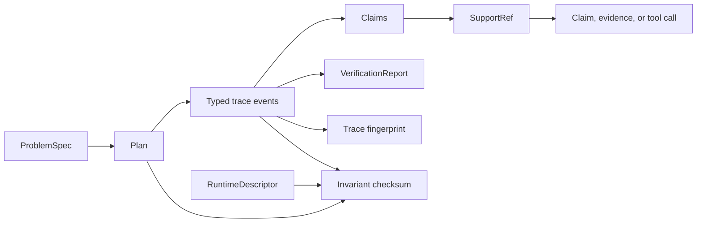

# Domain Language

`bijux-canon-reason` turns a declared problem into a content-addressed plan,
an ordered trace, typed claims, and a verification report. These objects are
related, but they answer different questions. Keeping their names precise is
essential when a result is reviewed or replayed later.

## Problem and plan

| Term | Exact meaning |
| --- | --- |
| `ProblemSpec` | The declared question, constraints, expected output type, optional expected structure, and optional version. When `id` is omitted, the model derives it from that content. |
| specification identity | The `spec_…` content identifier generated for an omitted `id`, or an explicitly supplied identifier preserved by the model. Prefer the generated identity when content-addressing is required. |
| `Plan` | The content-addressed dependency graph built for one specification. It binds `spec_id`, nodes, and directed edges. |
| `PlanNode` | One executable node with a kind, dependencies, parameters, and `StepSpec`. |
| step kind | One of `understand`, `gather`, `derive`, `verify`, or `finalize`. This is a typed lifecycle role, not free-form prose. |
| preset | The named planning/execution policy recorded with the run. `default` is the CLI default. |
| seed | The integer input used by deterministic runtime behavior and included in run identity. |

A plan is not an execution record. It declares intended work and dependency
order; the trace records what occurred.

## Trace and runtime

| Term | Exact meaning |
| --- | --- |
| `Trace` | The typed, ordered event record for an execution, with specification and plan identities plus protocol, schema, fingerprint, and canonicalization versions. |
| trace event | A `step_started`, `step_finished`, `tool_called`, `tool_returned`, `evidence_registered`, or `claim_emitted` record. |
| step output | A typed result for a lifecycle step. `insufficient_evidence` is a first-class output, not an execution crash. |
| `RuntimeDescriptor` | The runtime kind and mode plus each tool's name, version, and configuration fingerprint. |
| live runtime | A runtime allowed to execute configured tools. |
| frozen runtime | A replay runtime that returns recorded tool results instead of invoking live tools. |

Trace identity is derived from the full canonical trace content, including its
metadata. `fingerprint.txt` is the SHA-256 fingerprint of the canonical JSONL
serialization written for the run.

## Claims, evidence, and support

| Term | Exact meaning |
| --- | --- |
| `Claim` | A typed statement with status, confidence, support references, claim type, and optional structured content. |
| claim status | `proposed`, `validated`, or `rejected`. Status is an explicit judgment, not an implication of confidence. |
| claim type | `derived`, `observed`, or `assumed`. It describes how the statement entered the reasoning record. |
| `EvidenceRef` | A content-addressed reference to a source URI, SHA-256 digest, byte span, chunk identifier, and safe relative content path. |
| `SupportRef` | An immutable edge from a claim to a claim, evidence item, or tool call. It binds the target identifier, exact span, and snippet digest. |
| evidence file | The bytes stored inside the run bundle and named by `EvidenceRef.content_path`. The digest and span make support independently checkable. |

An evidence reference says which bytes were registered. A support reference
says which exact portion supports a claim. A claim without the required support
is still representable, but verification can reject it.

## Verification

| Term | Exact meaning |
| --- | --- |
| `VerificationCheck` | One named invariant evaluation with a pass flag, optional details, and metrics. |
| `VerificationFailure` | A finding with `info`, `warning`, or `error` severity, a message, and an optional invariant identifier. |
| `VerificationReport` | The complete collection of checks, failures, summary metrics, and associated trace identity. |
| insufficient evidence | A governed reasoning outcome that states the evidence threshold was not met. It is distinct from malformed artifacts or a failed invariant. |

`verify.json` is the report created as part of a run. A later standalone
`verify` invocation writes `verify.verify.json`, preserving the original report
instead of overwriting it.

## Integrity and replay

| Term | Exact meaning |
| --- | --- |
| run ID | A stable identifier derived from specification identity, preset, seed, and runtime fingerprint. |
| trace fingerprint | A digest of the canonical JSONL trace file, used to compare original and replayed event records. |
| invariant checksum | A digest over the plan, trace, and runtime descriptor. It is recorded in `run_meta.json` and trace metadata. |
| manifest | A sorted map of run-relative artifact paths to SHA-256 file digests. It inventories the core files, evidence, and retrieval provenance present when the run was built. |
| replay | Re-execution through a frozen runtime using recorded tool returns, followed by invariant-checksum and trace-fingerprint comparison. |
| re-run | A new live execution. Even with the same specification and seed, it is not evidence that the old artifacts replayed successfully. |

Replay requires `spec.json`, `plan.json`, and `run_meta.json` beside the trace.
When retrieval provenance is recorded, it also requires the pinned corpus,
index, and provenance document. Replay does not currently validate
`manifest.json`; consumers that require whole-bundle integrity must verify the
manifest's file digests separately.
