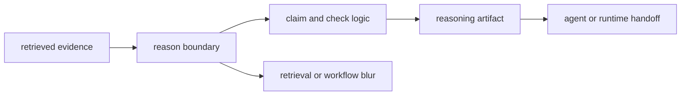

# Foundation

Open this section when the dispute is about what retrieved evidence means once it becomes a claim, check, or reasoning artifact. These pages should make `bijux-canon-reason` defensible as the place where evidence becomes inspectable conclusions rather than raw search output or agent choreography.

## Boundary Model

The foundation pages for reason have to defend one sharp idea: this is where
evidence becomes meaning that another reviewer can inspect. If that move is not
clear here, later workflow and runtime docs will end up carrying reasoning
policy they should never have inherited.

## Read These First

- open [Ownership Boundary](https://bijux.io/bijux-canon/04-bijux-canon-reason/foundation/ownership-boundary/) first when the behavior could belong in retrieval below or orchestration above
- open [Package Overview](https://bijux.io/bijux-canon/04-bijux-canon-reason/foundation/package-overview/) when you need the shortest stable description of the package role
- open [Lifecycle Overview](https://bijux.io/bijux-canon/04-bijux-canon-reason/foundation/lifecycle-overview/) when the question is how evidence turns into verified reasoning output

## The Mistake This Section Prevents

The most common mistake here is burying reasoning policy inside retrieval artifacts or workflow code until no one can explain which layer actually made the decision.

## First Proof Check

- `packages/bijux-canon-reason/src/bijux_canon_reason` for the owned reasoning boundary in code
- `packages/bijux-canon-reason/tests` for proof that claims, checks, and provenance stay aligned
- `packages/bijux-canon-reason/README.md` for the public package contract readers encounter first

## Pages In This Section

- [Package Overview](https://bijux.io/bijux-canon/04-bijux-canon-reason/foundation/package-overview/)
- [Scope and Non-Goals](https://bijux.io/bijux-canon/04-bijux-canon-reason/foundation/scope-and-non-goals/)
- [Ownership Boundary](https://bijux.io/bijux-canon/04-bijux-canon-reason/foundation/ownership-boundary/)
- [Repository Fit](https://bijux.io/bijux-canon/04-bijux-canon-reason/foundation/repository-fit/)
- [Capability Map](https://bijux.io/bijux-canon/04-bijux-canon-reason/foundation/capability-map/)
- [Domain Language](https://bijux.io/bijux-canon/04-bijux-canon-reason/foundation/domain-language/)
- [Lifecycle Overview](https://bijux.io/bijux-canon/04-bijux-canon-reason/foundation/lifecycle-overview/)
- [Dependencies and Adjacencies](https://bijux.io/bijux-canon/04-bijux-canon-reason/foundation/dependencies-and-adjacencies/)
- [Change Principles](https://bijux.io/bijux-canon/04-bijux-canon-reason/foundation/change-principles/)

## Leave This Section When

- leave this section for [Architecture](https://bijux.io/bijux-canon/04-bijux-canon-reason/architecture/) when the question is already about modules or execution flow
- leave this section for [Interfaces](https://bijux.io/bijux-canon/04-bijux-canon-reason/interfaces/) when the issue is a command, schema, artifact, or import surface
- leave this section for [Quality](https://bijux.io/bijux-canon/04-bijux-canon-reason/quality/) when the reasoning boundary is understood and the open question is whether the package has earned trust

## Design Pressure

If a page here starts sounding like search tuning or workflow coordination, the
reason boundary is already undercut. This section has to keep interpretation
separate from both retrieval below and orchestration above.
