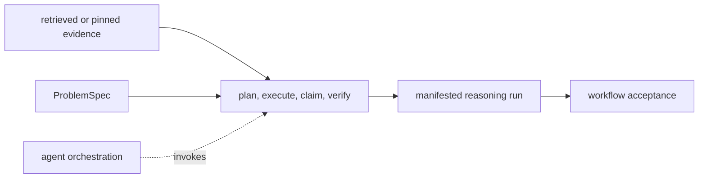

# Foundation

`bijux-canon-reason` converts a declared problem and evidence set into an
inspectable reasoning record. It plans the work, records tool and evidence
events, emits typed claims, verifies structural and grounding invariants, and
packages the result as a content-addressed run.

## Reasoning boundary

```mermaid
flowchart LR
    retrieval["retrieved or pinned evidence"]
    spec["ProblemSpec"]
    reason["plan, execute, claim, verify"]
    bundle["manifested reasoning run"]
    agent["agent orchestration"]
    runtime["workflow acceptance"]

    retrieval --> reason
    spec --> reason --> bundle
    agent -. invokes .-> reason
    bundle --> runtime
```

The package owns interpretation records, not universal truth. Retrieval order
and backend scoring remain index concerns. Multi-call scheduling and provider
policy remain agent concerns. Acceptance of an end-to-end workflow remains a
runtime concern.

## Claim contract

| Dimension | Values or content | Review value |
| --- | --- | --- |
| kind | observed, assumed, derived | distinguishes source facts from premises and inference |
| status | proposed, validated, rejected | prevents proposal from being mistaken for accepted output |
| support | claim, evidence, or tool reference with exact span and snippet digest | makes grounding byte-inspectable |
| confidence | bounded assessment supplied with the claim | records judgment without substituting for support |
| identity | content-derived claim reference | reveals contract changes rather than reusing identity |

A reference to a document is not sufficient grounding. A support record binds
the claim to exact bytes and a SHA-256 digest so the verifier can distinguish a
stable source span from a nearby or replaced passage.

## Verification meaning

A passing verification report means the registered structural, provenance,
hash, support, tool, and replay invariants passed over the retained record. It
does not prove source authority, corpus completeness, calibrated confidence,
absence of counterevidence, or real-world truth. `insufficient_evidence` is an
explicit controlled outcome and must not be rewritten as an execution error.

## Reference execution

The bundled reasoner is extractive. The local retrieval path uses BM25 over a
pinned corpus; the alternative default runtime is deterministic and local.
These paths provide a reproducible reference implementation, not a claim of
general reasoning or state-of-the-art search.

## Read by question

| Question | Guide |
| --- | --- |
| What stable problem does the package solve? | [Package overview](package-overview.md) |
| Which responsibilities are excluded? | [Scope and non-goals](scope-and-non-goals.md) |
| Where do index, reason, agent, and runtime authority meet? | [Ownership boundary](ownership-boundary.md) and [Repository fit](repository-fit.md) |
| Which planning, evidence, claim, and verification capabilities exist? | [Capability map](capability-map.md) |
| How does a problem become a complete run? | [Lifecycle overview](lifecycle-overview.md) |
| What do support, trace, fingerprint, and replay mean? | [Domain language](domain-language.md) |
| Which changes preserve reviewability? | [Change principles](change-principles.md) |
| Which adjacent systems can alter evidence or execution? | [Dependencies and adjacencies](dependencies-and-adjacencies.md) |
