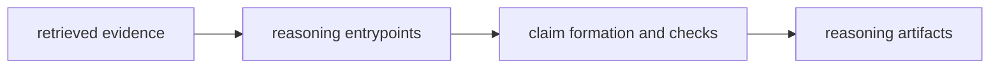

# Lifecycle Overview

The reasoning lifecycle starts when retrieved evidence reaches a reasoning entrypoint and ends when claims and checks are explicit enough for a reviewer or downstream package to inspect.

## Lifecycle Flow

This page should make the reasoning lifecycle legible as the point where
evidence becomes explicit claims. A reader should be able to follow that
transition without needing orchestration or runtime language to finish it.

## Lifecycle Shape

- evidence reaches the package through controlled interfaces and reasoning inputs
- package logic forms claims, runs checks, and records provenance under named ownership
- artifacts leave the package as inspectable reasoning outputs rather than raw retrieval output

## Handoff Point

The lifecycle stops before role coordination and run authority. Agent and runtime own those next layers.

## Design Pressure

If the lifecycle needs agent or runtime concepts to explain what a claim means,
reason has stopped owning its own semantics. The package has to end with
inspectable reasoning output, not with deferred interpretation.
