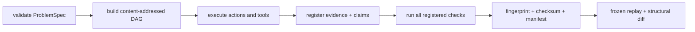

# Lifecycle Overview

The reasoning lifecycle produces a mutually constraining evidence directory.
Planning, execution, grounding, verification, finalization, and replay are
separate boundaries so a plausible final answer cannot substitute for its
history.

```mermaid
flowchart LR
    spec["validate ProblemSpec"]
    plan["build content-addressed DAG"]
    execute["execute actions and tools"]
    ground["register evidence + claims"]
    verify["run all registered checks"]
    finalize["fingerprint + checksum + manifest"]
    replay["frozen replay + structural diff"]

    spec --> plan --> execute --> ground --> verify --> finalize --> replay
```

## Planning

1. Validate the problem description, constraints, expected output, and optional
   expected result.
2. Derive stable problem identity when the caller does not supply it.
3. Construct an acyclic plan whose content-addressed nodes declare kind,
   dependencies, tool requests, parameters, and notes.
4. Reject missing dependencies, cycles, duplicate identity, and unsupported
   structure before execution.

## Execution and grounding

1. Resolve the seeded local runtime or a caller-supplied runtime descriptor.
2. Record ordered action starts, tool calls and returns, evidence registration,
   claim emission, action completion, and explicit insufficiency.
3. For pinned retrieval, retain corpus, chunks, BM25 index, and retrieval
   provenance under the run.
4. Bind claim support to evidence, claim, or tool identity plus an exact byte
   interval and SHA-256 snippet digest.

## Verification and publication

The verifier executes the ordered registry covering core structure, tool
linkage, claim references, derived grounding, reasoning trace, insufficiency,
finalized status, required actions, evidence hashes, and support spans. It
retains every result and failure rather than short-circuiting to a Boolean.

The run workflow then writes the specification, plan, trace, verification
report, trace fingerprint, runtime metadata, manifest, and any evidence or
provenance files. The run ID binds specification, preset, seed, and runtime
fingerprint. Each digest answers a different integrity question; no individual
file is authoritative alone.

## Replay

Replay validates the original invariant checksum and retained retrieval
provenance, loads recorded tool returns into a frozen runtime, executes the
original plan, recomputes the checksum, and writes a separate replay trace. It
then compares fingerprints and emits a structural diff.

A changed corpus, plan, runtime descriptor, checksum, or support record blocks
an equivalence claim. Matching replay demonstrates reproducibility of the
retained workflow, not renewed agreement from an external source.

## Terminal outcomes

The lifecycle can produce validated claims, rejected claims, verification
findings, or explicit insufficient evidence. CLI policy may promote findings
to a non-zero exit, but the report remains the evidence. The lifecycle ends
with a reviewable reasoning run; agent scheduling and runtime acceptance occur
outside it.
