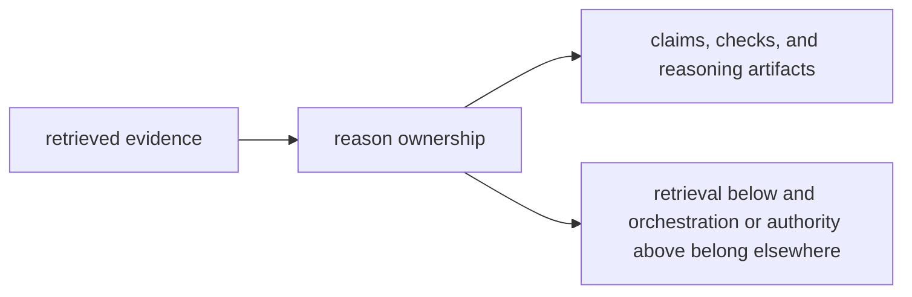

# Ownership Boundary

`bijux-canon-reason` owns the moment where evidence becomes a claim, check, or reasoning artifact. Use it when policy could easily be hidden in retrieval output below or workflow code above.

## Boundary Map

This page should show reason as the package that turns evidence into explicit
meaning. The boundary holds when readers can stop here before workflow or
runtime language starts taking over.

## Use This Boundary Test

- keep the work here when it changes claim formation, verification, provenance interpretation, or reasoning artifacts
- move the work down to `bijux-canon-index` when it changes how evidence is fetched or replayed
- move the work upward when it changes multi-step coordination or final run authority

## Borderline Example

A new verification rule belongs here. A new workflow rule for when verification should run belongs in agent.

## First Proof Check

- `packages/bijux-canon-reason/src` for the owned implementation boundary
- `packages/bijux-canon-reason/tests` for proof that the boundary survives change
- neighboring handbook roots in index, agent, and runtime when the work still looks plausible elsewhere

## Design Pressure

The pressure on reason is to keep claim policy local instead of letting meaning
leak into search tuning below or workflow code above. Once readers need another
package to explain a claim, the ownership story has weakened.
