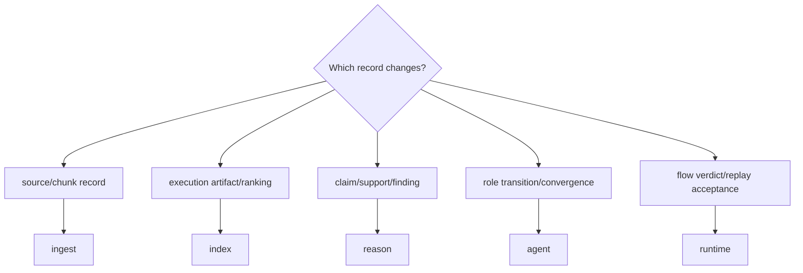

# Ownership Boundary

Reason authority is the relationship between evidence and explicit claims. It
owns how support is represented and verified, while leaving evidence retrieval,
role scheduling, and final workflow acceptance to their respective layers.

```mermaid
flowchart TD
    change{"Which record changes?"}
    representation["source/chunk record"]
    retrieval["execution artifact/ranking"]
    claim["claim/support/finding"]
    workflow["role transition/convergence"]
    authority["flow verdict/replay acceptance"]

    change --> representation --> ingest["ingest"]
    change --> retrieval --> index["index"]
    change --> claim --> reason["reason"]
    change --> workflow --> agent["agent"]
    change --> authority --> runtime["runtime"]
```

## Decision table

| Change | Owner | Reason |
| --- | --- | --- |
| change chunk normalization or byte mapping | ingest | changes evidence representation before reasoning |
| change ANN candidates, scoring, or replay bounds | index | changes retrieval execution rather than interpretation |
| add a check that derived claims have valid exact support | reason | changes grounding and verification semantics |
| add a planner node kind or content-identity input | reason | changes the reasoning record itself |
| repeat critique after an unsatisfactory verifier role | agent | changes role lifecycle and workflow control |
| reject the entire flow when reasoning is non-certifiable | runtime | changes end-to-end acceptance policy |

## Index-to-reason handoff

Reason consumes identified evidence and retrieval provenance. It may retain a
pinned local corpus/index for the reference workflow, but it does not reinterpret
the index package's score as support. Support is established separately through
an evidence identity, exact byte interval, and snippet hash.

This distinction prevents a high-ranked passage from becoming an accepted
claim merely because retrieval considered it similar.

## Reason-to-agent handoff

Reason produces a self-contained plan, trace, claim set, verification report,
and manifested run. Agent may schedule reasoning-related roles and preserve
their outputs, but it must not rewrite claim status or hide findings inside
workflow summaries. Conversely, reason does not decide whether another role
should run or whether convergence has occurred.

## Reason-to-runtime handoff

Runtime can apply flow policy to reasoning evidence. It may accept, reject, or
mark a run non-certifiable, but the underlying verification findings remain
unchanged. Arbitration over a complete flow is not a second reason verifier.

## Three decisions that must remain separate

| Decision | Owner | Required record | Does not decide |
| --- | --- | --- | --- |
| which material ranks for a query | index | request, artifact, backend, metric, score, rank and provenance | whether bytes support a claim |
| whether a claim is supported and passes checks | reason | claim type/status, exact supports, checks, findings, trace and manifest | whether another role runs or the whole flow is accepted |
| whether a complete flow is admissible | runtime | manifest, policy, lower-layer evidence, arbitration and replay envelope | what a reason finding originally observed |

A high retrieval score cannot validate a claim. A validated claim cannot
schedule another role. A runtime acceptance cannot rewrite a rejected claim.
These are distinct authorities even when one application displays them in a
single response.

## Minimum reasoning handoff

Reason publishes enough evidence for agent and runtime to preserve, inspect and
arbitrate its work:

| Handoff field | Custody purpose |
| --- | --- |
| problem specification and content identity | identifies the question, constraints and expected output |
| plan DAG and node identities | exposes intended derivation and verification order |
| runtime/tool/retrieval descriptors and call records | identifies external execution and evidence acquisition |
| evidence records and exact content digests/spans | anchors supports to inspectable bytes |
| claims with type, status, confidence and support references | preserves the epistemic object being reviewed |
| all checks, findings and unavailable/failure outcomes | prevents a summary from hiding verification coverage |
| semantic trace, byte fingerprint and invariant checksum | binds ordered reasoning events and integrity evidence |
| run manifest and replay comparison | binds files into one run and records later divergence |

Agent may embed these records in role inputs or trace entries. Runtime may
apply flow policy. Neither may replace the packet with final prose and still
claim to preserve reasoning custody.

## Route a broken handoff

| First false invariant | Owner |
| --- | --- |
| wrong source/chunk bytes or missing preparation mapping | ingest |
| wrong backend/rank/provenance for immutable evidence | index |
| invalid support span, changed evidence digest, wrong claim status or missing finding | reason |
| reasoning packet is correct but role order, merge, veto or trace projection is wrong | agent |
| packet is intact but tenant policy, certification or replay acceptance is wrong | runtime |

The package that detects the break retains it visibly, but ownership follows
the first false semantic record.

## Ownership test

Locate the false invariant. Ranking and backend provenance point to index.
Claim kind, support linkage, evidence bytes, check outcomes, and reasoning-run
integrity point to reason. Role order points to agent. Final authority points
to runtime.
