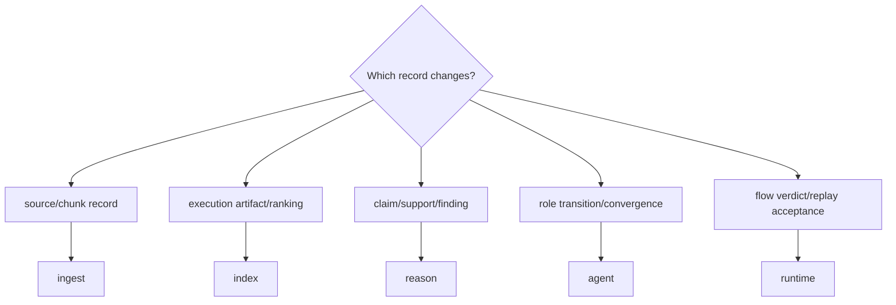

# Ownership Boundary

Reason authority is the relationship between evidence and explicit claims. It
owns how support is represented and verified, while leaving evidence retrieval,
role scheduling, and final workflow acceptance to their respective layers.

```mermaid
flowchart TD
    change{"Which record changes?"}
    representation["source/chunk record"]
    retrieval["execution artifact/ranking"]
    claim["claim/support/finding"]
    workflow["role transition/convergence"]
    authority["flow verdict/replay acceptance"]

    change --> representation --> ingest["ingest"]
    change --> retrieval --> index["index"]
    change --> claim --> reason["reason"]
    change --> workflow --> agent["agent"]
    change --> authority --> runtime["runtime"]
```

## Decision table

| Change | Owner | Reason |
| --- | --- | --- |
| change chunk normalization or byte mapping | ingest | changes evidence representation before reasoning |
| change ANN candidates, scoring, or replay bounds | index | changes retrieval execution rather than interpretation |
| add a check that derived claims have valid exact support | reason | changes grounding and verification semantics |
| add a planner node kind or content-identity input | reason | changes the reasoning record itself |
| repeat critique after an unsatisfactory verifier role | agent | changes role lifecycle and workflow control |
| reject the entire flow when reasoning is non-certifiable | runtime | changes end-to-end acceptance policy |

## Index-to-reason handoff

Reason consumes identified evidence and retrieval provenance. It may retain a
pinned local corpus/index for the reference workflow, but it does not reinterpret
the index package's score as support. Support is established separately through
an evidence identity, exact byte interval, and snippet hash.

This distinction prevents a high-ranked passage from becoming an accepted
claim merely because retrieval considered it similar.

## Reason-to-agent handoff

Reason produces a self-contained plan, trace, claim set, verification report,
and manifested run. Agent may schedule reasoning-related roles and preserve
their outputs, but it must not rewrite claim status or hide findings inside
workflow summaries. Conversely, reason does not decide whether another role
should run or whether convergence has occurred.

## Reason-to-runtime handoff

Runtime can apply flow policy to reasoning evidence. It may accept, reject, or
mark a run non-certifiable, but the underlying verification findings remain
unchanged. Arbitration over a complete flow is not a second reason verifier.

## Ownership test

Locate the false invariant. Ranking and backend provenance point to index.
Claim kind, support linkage, evidence bytes, check outcomes, and reasoning-run
integrity point to reason. Role order points to agent. Final authority points
to runtime.
