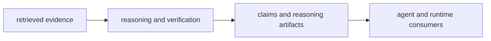

# Package Overview

`bijux-canon-reason` exists to turn retrieved evidence into inspectable claims, checks, and reasoning artifacts. It owns the logic that makes conclusions reviewable instead of leaving meaning scattered across prompts, retrieval output, and workflow code.

## Role Model

This page should make reason feel like the package where evidence becomes
meaning in a reviewable form. The package earns its place only if a reader can
see how claims are produced without shifting that burden onto orchestration.

## Boundary Verdict

If the disputed behavior decides what evidence means, how a claim is checked, or which reasoning artifact should exist after evaluation, it belongs here. If it only fetches evidence or coordinates multiple steps, it does not.

## What This Package Makes Possible

- reviewers can inspect how evidence became a claim instead of inferring intent from raw outputs
- verification logic stays close to the reasoning decision it protects
- agent and runtime layers can consume reasoning artifacts without re-owning reasoning policy

## Tempting Mistakes

- hiding reasoning policy inside retrieval scoring or output shaping
- letting orchestration code decide claim meaning because it is closer to the workflow
- using runtime persistence as a substitute for reasoning clarity

## First Proof Check

- `packages/bijux-canon-reason/src/bijux_canon_reason` for the reasoning boundary in code
- `packages/bijux-canon-reason/tests` for claim, verification, and provenance evidence
- `packages/bijux-canon-reason/README.md` for the public package contract

## Design Pressure

The pressure on reason is to keep claim formation explicit instead of letting
meaning leak into retrieval tuning or workflow glue. If claim policy becomes
hard to locate, the evidence chain becomes harder to defend.
