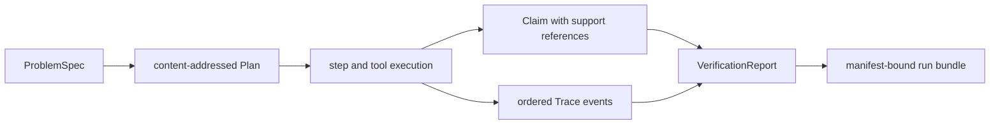

# Package Overview

`bijux-canon-reason` turns evidence into typed, inspectable claims. It models a
problem, builds a content-addressed plan, executes bounded steps, records an
event trace, and verifies that claims remain connected to their support.

The central output is not prose alone. It is a reasoning bundle that lets a
reviewer inspect what was asked, what ran, which evidence supported each claim,
and whether replay reconstructed the same trace.

## Reasoning Lifecycle


```mermaid
flowchart LR
    problem["ProblemSpec"]
    plan["content-addressed Plan"]
    execute["step and tool execution"]
    claim["Claim with support references"]
    trace["ordered Trace events"]
    verify["VerificationReport"]
    bundle["manifest-bound run bundle"]

    problem --> plan --> execute
    execute --> claim
    execute --> trace
    claim --> verify
    trace --> verify
    verify --> bundle
```

Equivalent canonical problem content produces the same specification identity.
Plans, traces, and other core models also carry content-derived identifiers,
making identity part of the evidence chain rather than a random label added
after execution.

## Public Model

| Model or helper | Role |
| --- | --- |
| `ProblemSpec` | declares the question, constraints, expected output, and schema version |
| `Plan` and `PlanNode` | define ordered work and dependencies |
| `ToolRequest` and `ToolResult` | bind an invocation to its recorded result |
| `EvidenceRef` and `SupportRef` | locate the material supporting a claim |
| `Claim` | represents a typed conclusion with support |
| `Trace` | preserves ordered execution and reasoning events |
| `VerificationReport` | records invariant, provenance, and grounding findings |
| fingerprint helpers | canonicalize and compare durable reasoning records |

These models and their validators are available from `bijux_canon_reason`.
Execution, verification, serialization, retrieval, and API behavior remain in
their owning submodules.

## Create a Verified Run

```bash
bijux-canon-reason run \
  --spec problem.json \
  --preset default \
  --seed 0 \
  --artifacts-dir artifacts/bijux-canon-reason \
  --fail-on-verify \
  --json
```

The run command writes the specification, plan, trace, verification report,
trace fingerprint, runtime metadata, and a bound manifest into one run
directory. `--fail-on-verify` prevents a successful command status when the
verification report contains findings; it does not erase the evidence.

## Verification Layers

Verification covers more than schema validity:

- plan topology and trace ordering;
- tool-request and tool-result linkage;
- claim-to-support linkage and exact evidence spans;
- evidence digests and retrieval provenance;
- insufficient-evidence handling and finalization;
- invariant checksums used by replay.

A final sentence can look plausible while one of these layers is broken. The
report preserves that distinction so callers can enforce their own acceptance
policy.

## Replay Semantics

Replay uses the stored specification, plan, recorded tool results, and governed
provenance artifacts. It does not silently replace historical tool calls with
new live results. The reconstructed trace receives its own fingerprint and is
diffed against the original.

Fingerprint equality establishes equality of the canonical trace record under
the implemented replay contract. It does not establish that the original
evidence was true or that a different reasoning method would reach the same
claim.

## Ownership Boundary

Reason owns claim formation, support linkage, verification, reasoning traces,
and replay of those records. It can consume retrieval evidence, but it does not
own general-purpose indexing. It can produce artifacts for an agent or runtime,
but it does not own orchestration authority or system-wide run acceptance.

The `bijux-rar` command and compatibility distribution preserve the established
legacy surface. New code should use `bijux-canon-reason` and
`bijux_canon_reason`; consult
[compatibility commitments](../interfaces/compatibility-commitments.md) before
changing an existing integration.

Continue with [installation and setup](../operations/installation-and-setup.md)
or [entrypoint examples](../interfaces/entrypoints-and-examples.md).
