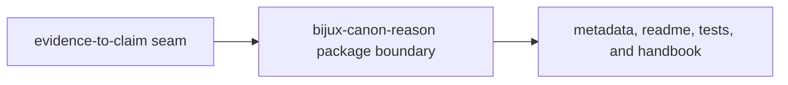

# Repository Fit

`bijux-canon-reason` is a separate package because reviewable meaning is a real system seam. The repository needs one place where evidence-to-claim policy is explicit instead of being inferred from lower or higher layers.

## Fit Model

This page should explain why reasoning exists as a package and not as glue
inside retrieval or orchestration. The fit is good only when meaning itself is
treated as a publishable, reviewable boundary.

## Why This Is A Package

- `packages/bijux-canon-reason/src/bijux_canon_reason` keeps reasoning ownership visible in code
- `packages/bijux-canon-reason/tests` proves claim, verification, and provenance behavior together
- the package root and handbook explain why downstream layers may consume reasoning artifacts without re-owning the policy

## First Proof Check

- `packages/bijux-canon-reason/pyproject.toml` for publishable package identity
- `packages/bijux-canon-reason/README.md` for package-level reader framing
- `packages/bijux-canon-reason/tests` for executable proof that the seam still matters

## Fit Warning

If the package exists only because the code looked complex enough to split out, the reasoning seam is not being defended on its actual merits.

## Design Pressure

If reason is justified only by complexity or code volume, the seam is already
being defended on the wrong grounds. The repository has to keep the
evidence-to-claim boundary explicit.
