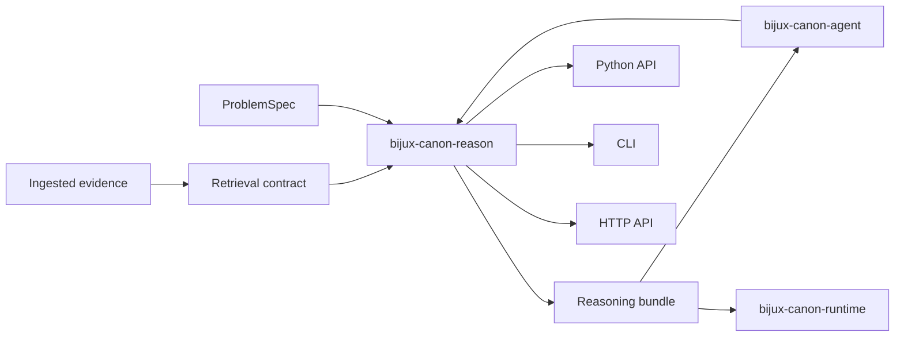

# Repository Fit

`bijux-canon-reason` is the independently installable evidence-to-claim layer
in the Canon family. It gives plans, claims, support references, traces,
verification reports, and replay results a stable home. That boundary lets a
caller adopt reviewable reasoning without also adopting agent scheduling or the
complete workflow runtime.

## Package boundary


```mermaid
flowchart LR
    I[Ingested evidence] --> X[Retrieval contract]
    X --> R[bijux-canon-reason]
    S[ProblemSpec] --> R
    R --> B[Reasoning bundle]
    A[bijux-canon-agent] --> R
    B --> A
    B --> W[bijux-canon-runtime]
    R --> P[Python API]
    R --> C[CLI]
    R --> H[HTTP API]
```

The package consumes evidence and retrieval results but does not own parsing or
ranking. Agents may invoke it, but role selection and convergence remain agent
policy. Runtime may accept or reject its bundle as part of a larger run, but
cross-package admission and effect policy remain runtime concerns.

## Why the boundary is independently useful

Reasoning has durable data contracts that outlive any single backend. A
`Claim`, `SupportRef`, `Trace`, or `VerificationReport` must mean the same thing
whether execution is initiated through Python, the CLI, HTTP, an agent, or the
workflow runtime. Packaging those contracts with their canonicalization,
verification, persistence, and replay logic prevents each caller from inventing
a weaker evidence model.

The package is intentionally not a generic prompt library. Its value is the
governed record around reasoning: content identity, typed lifecycle events,
byte-addressable grounding, explicit insufficiency, invariant failures, and
frozen replay.

## Public surfaces

| Surface | Role | Contract |
| --- | --- | --- |
| Python package | construct specifications, plans, runtimes, claims, and verification workflows | typed models and explicit application services |
| `bijux-canon-reason` CLI | initialize inputs, run, verify, and replay reasoning artifacts | process exit, structured output, and on-disk bundle |
| `bijux-rar` CLI | compatibility entry point | delegates to the canonical CLI; it does not define separate behavior |
| FastAPI application | expose run and artifact operations to controlled network clients | request guards, versioned routes, and the same artifact semantics |
| run bundle | transfer a result across process and package boundaries | canonical files, evidence, provenance, fingerprints, and manifest |

Surface parity means equivalent semantics, not identical transport syntax. A
CLI exit code and an HTTP status may differ in representation while referring
to the same governed failure and retained artifact state.

## Repository placement

The monorepo keeps five concerns visible together while publishing them as
separate packages:

```text
packages/bijux-canon-reason/
├── src/bijux_canon_reason/   # models, planning, execution, traces, verification, interfaces
├── tests/                    # unit, contract, integration, and end-to-end evidence
├── README.md                 # package entry point
└── pyproject.toml            # distribution and interface metadata
```

The reason package may depend on general Python libraries and shared protocol
contracts. It must not require the agent or runtime package to define the
meaning of its own artifacts. Higher layers consume or orchestrate reason; they
do not complete an otherwise partial reasoning model.

## Boundary failure conditions

The repository fit has degraded if:

- callers must parse prose to discover claim status or support;
- retrieval scores are promoted directly to claim validation;
- agent or runtime state is required to verify a standalone reasoning bundle;
- CLI, HTTP, and Python paths emit incompatible artifact meaning;
- compatibility entry points develop behavior absent from the canonical CLI;
- replay silently invokes live tools or an unpinned corpus; or
- the package becomes a bucket for any code associated with language models.

The boundary is justified by ownership of reviewable meaning, not by code
volume. If plans, claims, support, traces, verification, and replay cease to
form one coherent contract, the package shape should be reconsidered rather
than defended by history.
