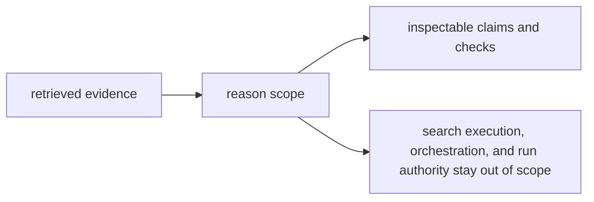

# Scope and Non-Goals

The scope of `bijux-canon-reason` is to make conclusions inspectable. It is not a fallback place for any logic that feels “smart.”

## Scope Map

This page should make the reasoning scope feel exact, not mystical. The package
owns meaning and verification only when those outputs stay inspectable enough
to stand without workflow or runtime explanation.

## In Scope

- turning retrieved evidence into claims, checks, and reasoning artifacts
- reasoning-side provenance and verification behavior
- package-local interfaces that expose reasoning outputs as intentional surfaces

## Non-Goals

- search execution and retrieval replay behavior
- role coordination across multi-step agent workflows
- runtime persistence, acceptance, or governed replay authority

## Scope Check

If the change adds cleverness without making claims easier to inspect or verify, it is probably not reasoning ownership.

## Design Pressure

If “smart behavior” becomes an excuse to absorb neighboring responsibilities,
reason turns into a blur instead of a contract. The non-goals keep the package
honest about what reasoning actually owns.
