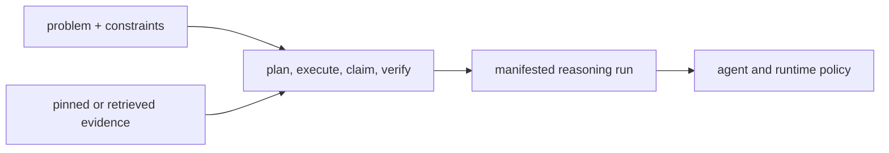

# Scope and Non-Goals

`bijux-canon-reason` owns inspectable reasoning records. It turns a declared
problem and evidence into a content-addressed plan, typed events, supported
claims, verification findings, and a manifested run that can be reviewed and
replayed from retained inputs.

```mermaid
flowchart LR
    spec["problem + constraints"]
    evidence["pinned or retrieved evidence"]
    reason["plan, execute, claim, verify"]
    run["manifested reasoning run"]
    orchestration["agent and runtime policy"]

    spec --> reason
    evidence --> reason --> run --> orchestration
```

## In scope

- immutable problem, plan, claim, trace, evidence, support, and verification
  models with content-derived identity;
- deterministic planning over understand, gather, derive, verify, and finalize
  actions;
- runtime and tool protocols, ordered event recording, fail-fast execution,
  and explicit insufficient-evidence outcomes;
- local pinned-corpus BM25 retrieval and extractive reasoning as a reproducible
  reference path;
- exact support spans, snippet hashes, evidence provenance, derived grounding,
  structural verification, and registered check results;
- canonical JSON/JSONL, trace fingerprints, invariant checksums, manifests,
  frozen replay, and structural diffs;
- CLI, Python, HTTP run, verification, replay, evaluation, and artifact
  inspection surfaces.

## Non-goals

| Not owned here | Owning boundary |
| --- | --- |
| Preparing source text or defining chunk representation | `bijux-canon-ingest` |
| Governing vector backend selection, ANN bounds, or retrieval replay | `bijux-canon-index` |
| Choosing which reasoning role runs next or when a workflow converges | `bijux-canon-agent` |
| Accepting a complete tenant flow or governing end-to-end replay | `bijux-canon-runtime` |
| Proving a source is authoritative, current, complete, or true | domain review and source governance |
| Automatically calibrating claim confidence | caller or domain-specific calibration process |
| Distributed retrieval, scheduling, sandboxing, quotas, or secret management | hosting system |

## Verification boundary

Verification proves that registered structural, linkage, provenance, hash,
support, tool, and replay rules passed over the retained record. It cannot find
all omitted evidence, expose every unstated assumption, or turn faithfully
hashed false content into truth.

The bundled extractive reasoner and BM25 retriever are reference components.
They demonstrate the artifact and replay contract; they are not claims of
general reasoning ability or state-of-the-art retrieval.

## Scope test

A change belongs here when it changes the inspectable relationship among a
problem, plan, evidence, tool result, claim, finding, or reasoning-run digest.
If it changes retrieval ranking rather than support meaning, workflow order
rather than plan semantics, or run acceptance rather than verification facts,
it belongs in an adjacent package.

See the [capability map](capability-map.md) and
[known limitations](../quality/known-limitations.md) for the precise
implemented and epistemic boundaries.
