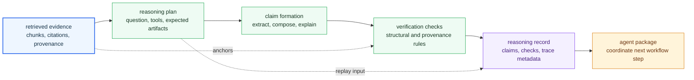

# Reasoning Handbook

`bijux-canon-reason` owns inspectable reasoning, verification, provenance, and reasoning-side run artifacts. It is where retrieved evidence becomes claims, checks, and reviewer-facing reasoning records instead of raw search results.

The main failure this handbook prevents is hiding reasoning policy inside retrieval output or orchestration flow. If this package does not say clearly how evidence turns into claims and checks, the system becomes hard to audit even when every lower layer technically works.

## What The Reader Should See First

Reason is the evidence interpretation layer. It does not merely pass retrieved
text upward. It creates structured reasoning records: what claim was made, what
evidence supported it, which checks ran, and what trace lets a reviewer replay
or compare the reasoning later.

## What This Package Owns

- claim formation, reasoning-side verification, and provenance-aware reasoning records
- logic that turns retrieval output into inspectable conclusions and supporting checks
- reasoning artifacts that agent and runtime layers can consume without reinterpreting intent

## What This Package Does Not Own

- document preparation and retrieval execution below the reasoning boundary
- multi-step orchestration policy above one reasoning-capable step
- runtime acceptance, persistence, and final replay authority for whole runs

## Boundary Test

If the issue is about what evidence means, how a claim is verified, or which reasoning artifact should exist after evaluation, it belongs here. If the issue is about how evidence was fetched or how multiple steps are coordinated, it does not.

## First Proof Check

- `packages/bijux-canon-reason/src/bijux_canon_reason` for the owned reasoning implementation boundary
- `packages/bijux-canon-reason/src/bijux_canon_reason/core/models` for claim, verification, planning, and trace models
- `packages/bijux-canon-reason/src/bijux_canon_reason/verification` for structural and provenance checks
- `packages/bijux-canon-reason/tests` for proof that claims, verification, and provenance stay aligned
- `packages/bijux-canon-reason/README.md` for the package-level contract readers see before code

## Start Here

- open [Foundation](https://bijux.io/bijux-canon/04-bijux-canon-reason/foundation/) when the question is why this package exists or where its ownership stops
- open [Architecture](https://bijux.io/bijux-canon/04-bijux-canon-reason/architecture/) when you need module boundaries, dependency flow, or execution shape
- open [Interfaces](https://bijux.io/bijux-canon/04-bijux-canon-reason/interfaces/) when the question is about commands, APIs, schemas, imports, or artifacts that callers may treat as stable
- open [Operations](https://bijux.io/bijux-canon/04-bijux-canon-reason/operations/) when you need local workflow, diagnostics, release, or recovery guidance
- open [Quality](https://bijux.io/bijux-canon/04-bijux-canon-reason/quality/) when the question is whether the package has proved its promises strongly enough

## Pages In This Package

- [Foundation](https://bijux.io/bijux-canon/04-bijux-canon-reason/foundation/)
- [Architecture](https://bijux.io/bijux-canon/04-bijux-canon-reason/architecture/)
- [Interfaces](https://bijux.io/bijux-canon/04-bijux-canon-reason/interfaces/)
- [Operations](https://bijux.io/bijux-canon/04-bijux-canon-reason/operations/)
- [Quality](https://bijux.io/bijux-canon/04-bijux-canon-reason/quality/)

## Bottom Line

If a proposed change makes `bijux-canon-reason` broader without making its owned role easier to defend, the change is probably crossing a package boundary rather than improving the design.
