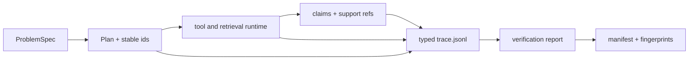
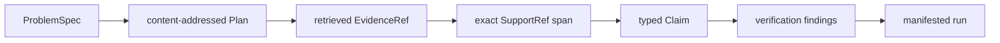

# Reasoning Handbook

`bijux-canon-reason` turns a `ProblemSpec` into a content-addressed plan,
evidence-backed claims, a typed event trace, a verification report, and a
manifested run directory. Its core models are immutable, serialize
canonically, and derive stable identifiers from content so a later replay can
compare the reasoning record rather than only its final prose.

A claim distinguishes observed, assumed, and derived content; proposed,
validated, and rejected status; and the support references behind it. Evidence
support includes a reference identity, exact span, and SHA-256 snippet digest.
Confidence without support does not become evidence by convention.

```mermaid
flowchart LR
    spec["ProblemSpec"]
    plan["Plan + stable ids"]
    runtime["tool and retrieval runtime"]
    claims["claims + support refs"]
    trace["typed trace.jsonl"]
    verify["verification report"]
    manifest["manifest + fingerprints"]

    spec --> plan --> runtime --> claims --> trace --> verify --> manifest
    plan --> trace
    runtime --> trace
```

## Run Evidence

Every CLI-built run writes a directory keyed by a stable run identifier:

| Artifact | Review question |
| --- | --- |
| `spec.json` | what problem and constraints were submitted? |
| `plan.json` | which ordered reasoning graph was approved? |
| `trace.jsonl` | which evidence, tools, claims, and checks occurred? |
| `verify.json` | which invariants passed or failed? |
| `fingerprint.txt` | does the serialized trace match during replay? |
| `run_meta.json` | which preset, seed, runtime, producer, and schema created it? |
| `manifest.json` | which files and digests make the run complete? |

The invariant checksum binds plan, trace, and runtime descriptor. Replay checks
fingerprints and emits a diff summary; it does not declare equivalence merely
because the final answer looks similar.

## Follow One Claim

```mermaid
flowchart LR
    problem[ProblemSpec]
    plan[content-addressed Plan]
    evidence[retrieved EvidenceRef]
    support[exact SupportRef span]
    claim[typed Claim]
    checks[verification findings]
    run[manifested run]

    problem --> plan --> evidence --> support --> claim --> checks --> run
```

| Claim field | Meaning | Evidence required for review |
| --- | --- | --- |
| kind | observed, assumed, or derived | the trace action that introduced it |
| status | proposed, validated, or rejected | verification findings and policy disposition |
| support | exact evidence relationship | evidence identity, byte span, and snippet digest |
| confidence | bounded assessment attached to the claim | declared method and supporting record; confidence is not evidence |
| identity | content-addressed claim reference | canonical serialization of the claim contract |

Evidence references are byte-sensitive. Normalizing or replacing the source
after a support span is recorded changes the content contract even when the
rendered sentence looks the same.

## Reasoning Trust Boundary

Reason consumes prepared or retrieved evidence and produces claims, checks,
and a manifested reasoning run. It does not own how a vector backend ranked the
evidence, how an agent schedules several reasoning calls, or whether runtime
policy accepts the whole flow.

The verifier checks registered structure, provenance, hashes, support, tool
capabilities, and replay invariants. A passing report means those checks passed
over the retained record. It does not certify that every relevant source was
retrieved or that a scientific conclusion is true.

## Review A Run In Order

1. Confirm `spec.json` and `plan.json` describe the intended problem and graph.
2. Follow evidence and tool events in `trace.jsonl` before reading final prose.
3. Match every validated claim to its `SupportRef` and content digest.
4. Read `verify.json`, including warnings and rejected findings.
5. Confirm `manifest.json` covers the retained files and their digests.
6. Use `fingerprint.txt` and replay output only after the run is complete.

The [entrypoint examples](interfaces/entrypoints-and-examples.md) show how to
create, verify, and replay that directory without discarding failed findings.

## Continue By Question

| Question | Next page |
| --- | --- |
| which reasoning concepts and responsibilities are stable? | [Foundation](foundation/index.md) |
| how do planning, execution, evidence, verification, and manifests connect? | [Architecture](architecture/index.md) |
| which Python, CLI, HTTP, and artifact contracts are callable? | [Interfaces](interfaces/index.md) |
| how do I create, inspect, verify, replay, or recover a run? | [Operations](operations/index.md) |
| which invariants bound support, hashes, traces, and replay? | [Quality](quality/index.md) |

## Verification Boundaries

Plan shape, trace topology, evidence paths, provenance, tool capability,
support references, content hashes, and replay checksums are validated
separately. Verification failures can be reported without immediate process
failure, or promoted to exit status `2` with `--fail-on-verify`. This makes the
policy choice explicit while preserving the report in either mode.
