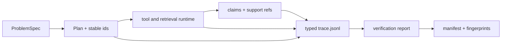

# Reasoning Handbook

`bijux-canon-reason` turns a `ProblemSpec` into a content-addressed plan,
evidence-backed claims, a typed event trace, a verification report, and a
manifested run directory. Its core models are immutable, serialize
canonically, and derive stable identifiers from content so a later replay can
compare the reasoning record rather than only its final prose.

A claim distinguishes observed, assumed, and derived content; proposed,
validated, and rejected status; and the support references behind it. Evidence
support includes a reference identity, exact span, and SHA-256 snippet digest.
Confidence without support does not become evidence by convention.

```mermaid
flowchart LR
    spec["ProblemSpec"]
    plan["Plan + stable ids"]
    runtime["tool and retrieval runtime"]
    claims["claims + support refs"]
    trace["typed trace.jsonl"]
    verify["verification report"]
    manifest["manifest + fingerprints"]

    spec --> plan --> runtime --> claims --> trace --> verify --> manifest
    plan --> trace
    runtime --> trace
```

## Run Evidence

Every CLI-built run writes a directory keyed by a stable run identifier:

| Artifact | Review question |
| --- | --- |
| `spec.json` | what problem and constraints were submitted? |
| `plan.json` | which ordered reasoning graph was approved? |
| `trace.jsonl` | which evidence, tools, claims, and checks occurred? |
| `verify.json` | which invariants passed or failed? |
| `fingerprint.txt` | does the serialized trace match during replay? |
| `run_meta.json` | which preset, seed, runtime, producer, and schema created it? |
| `manifest.json` | which files and digests make the run complete? |

The invariant checksum binds plan, trace, and runtime descriptor. Replay checks
fingerprints and emits a diff summary; it does not declare equivalence merely
because the final answer looks similar.

## What This Package Owns

- claim formation, reasoning-side verification, and provenance-aware reasoning records
- logic that turns retrieval output into inspectable conclusions and supporting checks
- reasoning artifacts that agent and runtime layers can consume without reinterpreting intent

## What This Package Does Not Own

- document preparation and retrieval execution below the reasoning boundary
- multi-step orchestration policy above one reasoning-capable step
- runtime acceptance, persistence, and final replay authority for whole runs

## Ownership Test

If the issue is about what evidence means, how a claim is verified, or which
reasoning artifact should exist after evaluation, it belongs here. If the
issue is about how evidence was fetched or how multiple steps are coordinated,
it does not.

## Implementation Anchors

- `packages/bijux-canon-reason/src/bijux_canon_reason` for the owned reasoning implementation boundary
- `packages/bijux-canon-reason/src/bijux_canon_reason/core/models` for claim, verification, planning, and trace models
- `packages/bijux-canon-reason/src/bijux_canon_reason/verification` for structural and provenance checks
- `packages/bijux-canon-reason/tests` for proof that claims, verification, and provenance stay aligned
- `packages/bijux-canon-reason/README.md` for the package-level contract readers see before code

## Start Here

- open [Foundation](https://bijux.io/bijux-canon/04-bijux-canon-reason/foundation/) when the question is why this package exists or where its ownership stops
- open [Architecture](https://bijux.io/bijux-canon/04-bijux-canon-reason/architecture/) when you need module boundaries, dependency flow, or execution shape
- open [Interfaces](https://bijux.io/bijux-canon/04-bijux-canon-reason/interfaces/) when the question is about commands, APIs, schemas, imports, or artifacts that callers may treat as stable
- open [Operations](https://bijux.io/bijux-canon/04-bijux-canon-reason/operations/) when you need local workflow, diagnostics, release, or recovery guidance
- open [Quality](https://bijux.io/bijux-canon/04-bijux-canon-reason/quality/) when the question is whether the package has proved its promises strongly enough

## Reference Areas

- [Foundation](https://bijux.io/bijux-canon/04-bijux-canon-reason/foundation/)
- [Architecture](https://bijux.io/bijux-canon/04-bijux-canon-reason/architecture/)
- [Interfaces](https://bijux.io/bijux-canon/04-bijux-canon-reason/interfaces/)
- [Operations](https://bijux.io/bijux-canon/04-bijux-canon-reason/operations/)
- [Quality](https://bijux.io/bijux-canon/04-bijux-canon-reason/quality/)

## Verification Boundaries

Plan shape, trace topology, evidence paths, provenance, tool capability,
support references, content hashes, and replay checksums are validated
separately. Verification failures can be reported without immediate process
failure, or promoted to exit status `2` with `--fail-on-verify`. This makes the
policy choice explicit while preserving the report in either mode.
