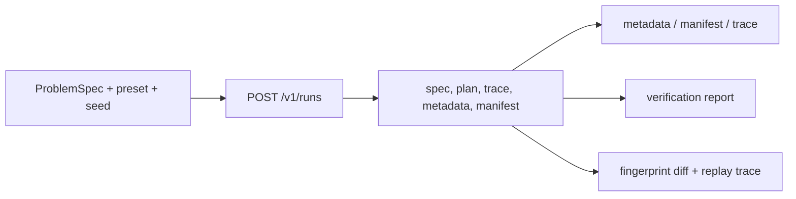

# HTTP API

The reasoning HTTP API exposes two file-backed boundaries: lightweight item
state and manifested reasoning runs. The FastAPI application is created by
`create_app(artifacts_dir=...)`; its default root is
`artifacts/bijux-canon-reason`.

## Operation Map

| Method and path | Success | Behavior |
| --- | --- | --- |
| `GET /health` | `200` | liveness response |
| `GET /v1/items` | `200` | paginated active items and total count |
| `POST /v1/items` | `201` | create, return an existing active name, or restore a deleted name |
| `GET /v1/items/{item_id}` | `200` | active item by numeric identity |
| `PUT /v1/items/{item_id}` | `200` | update an active item or create a missing numeric identity |
| `DELETE /v1/items/{item_id}` | `204` | soft-delete an active item |
| `POST /v1/runs` | `200` | build a manifested run and return run, trace, and fingerprint identities |
| `GET /v1/runs/{run_id}` | `200` | retained `run_meta.json` |
| `GET /v1/runs/{run_id}/manifest` | `200` | retained `manifest.json` |
| `GET /v1/runs/{run_id}/trace` | `200` | `trace.jsonl` as newline-delimited text |
| `POST /v1/runs/{run_id}/verify` | `200` | verification report computed from retained plan and trace |
| `POST /v1/runs/{run_id}/replay` | `200` | original/replayed fingerprints, diff summary, replay trace path |



## Create And Inspect A Run

```bash
curl --fail-with-body http://127.0.0.1:8000/v1/runs \
  --header 'content-type: application/json' \
  --data '{
    "spec": {
      "description": "Which evidence supports the retention period?",
      "constraints": {"require_citation": true},
      "expected_output_type": "Claim"
    },
    "preset": "default",
    "seed": 0
  }'
```

The precise `ProblemSpec` fields are governed by the schema; use the returned
`run_id` to retrieve metadata, manifest, and trace before interpreting the
verification or replay response.

## Item Semantics

Items are stored in `api_storage.db` beneath the artifact root. Deletion is
soft: deleted rows are hidden and return `404`. Creating the same active name
returns that row; creating a previously deleted name restores it. Updating a
missing numeric ID creates it, while updating a deleted ID is refused.

Only `name` and `description` are persisted and returned. The current request
models accept additional fields but do not retain them; clients must not use
those fields as durable item metadata. List requests accept only `limit` and
`offset`, return items in ascending ID order, and reject unknown query keys.

## Run Storage And Verification

Runs are directories beneath `<artifacts-root>/runs/<run-id>`. Run identifiers
are restricted to a bounded alphanumeric, dot, underscore, and hyphen form and
are sanitized before filesystem access. Missing metadata, manifests, traces,
or plans return `404` rather than an empty document.

`POST .../verify` reads the retained plan and trace, runs the current verifier,
and writes `verify.verify.json`. It does not rewrite the original trace or turn
a failed finding into transport failure. `POST .../replay` writes a replay
trace and reports fingerprint differences; a `200` response means comparison
completed, not that the fingerprints matched.

## Guards And Failure Semantics

- `RAR_API_TOKEN`, when configured, requires the exact value in
  `X-API-Token`. The current OpenAPI document does not declare this custom
  token as a security scheme, so deployment configuration remains essential.
- `RAR_API_RATE_LIMIT` enables the in-process request counter; `0` disables it.
- Requests larger than 8 KiB by declared content length return `413`.
- XML content types return `415`; JSON validation failures return a deliberately
  compact `422 {"detail":"invalid request"}` response.
- Authentication failure returns `401`; rate exhaustion returns `429`.
- Item list responses are bounded to 100 entries and 2 MiB. Oversized trace
  responses are also refused with `413`.
- These guards are process-local. They do not provide distributed rate
  limiting, tenant isolation, or a secret-management system.

## Contract Authority

The versioned schema is
[`apis/bijux-canon-reason/v1/schema.yaml`](https://github.com/bijux/bijux-canon/blob/main/apis/bijux-canon-reason/v1/schema.yaml),
with its pin and hash. Its response links connect created items and runs to
their follow-up operations. The route implementation, artifact layout, and
live contract tests establish behavior. See
[Artifact Contracts](artifact-contracts.md) and
[Entrypoints and Examples](entrypoints-and-examples.md) for the retained files
and server invocation.
