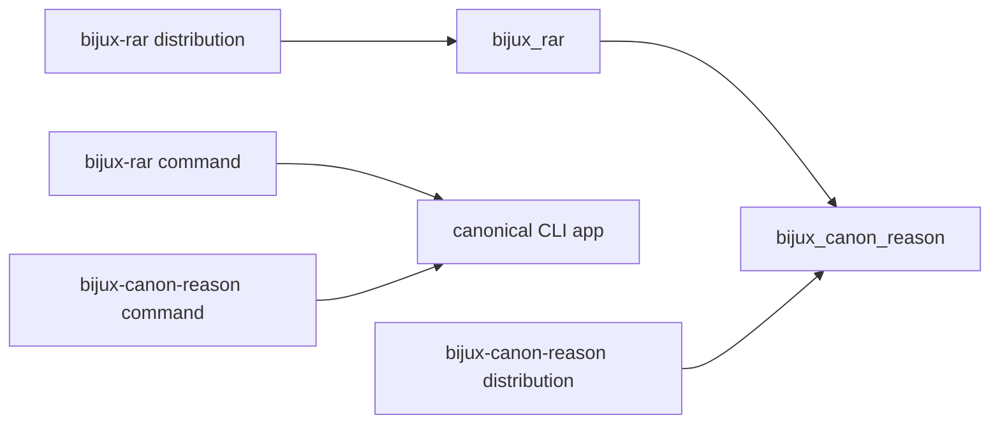
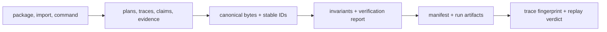

# Compatibility Commitments

The canonical distribution, import, and command are `bijux-canon-reason`,
`bijux_canon_reason`, and `bijux-canon-reason`.

`bijux-rar` is the synchronized compatibility distribution. It preserves the
`bijux_rar` import and `bijux-rar` command while executing the canonical package
implementation.

The alias forwards the canonical root export set, attribute access, discovery,
and runtime submodules. It is a naming bridge, not a separate reasoner or a
second artifact format.

## Compatibility Is An Evidence Chain

| Link | Evidence | Insufficient substitute |
| --- | --- | --- |
| name identity | same-release dependency, canonical module identity, direct CLI delegation | both commands start |
| model identity | canonical class identity and accepted model fields | similar serialized dictionaries |
| content identity | canonicalization version, algorithm, and derived IDs | matching labels or filenames |
| evidence validity | support spans, hashes, references, and verification findings | a claim has citations |
| artifact integrity | complete manifest and recorded checksums | directory exists |
| replay | original and replay trace fingerprints plus validated inputs | final text looks similar |

## Stable Surfaces

Compatibility-sensitive surfaces include:

- root models and validation helpers listed in `bijux_canon_reason.__all__`;
- CLI commands, option meaning, exit behavior, and machine-readable output;
- v1 HTTP schemas and status semantics;
- trace event discriminators and typed step-output variants;
- content-ID, canonical JSON, and fingerprint algorithms; and
- run layout, manifest coverage, protocol versions, and replay comparison.

Private execution helpers, internal check implementations, and storage wiring
are not public merely because their modules can be imported.

## Change Obligations

| Change | Required treatment |
| --- | --- |
| add a root model or helper | extend API inventory without changing existing semantics |
| remove or alter a root model, enum, or invariant | explicit compatibility decision and consumer migration |
| change canonical JSON or stable-ID inputs | versioned identity change with fixed-vector evidence |
| change trace events or step-output variants | schema/protocol decision plus reader and replay coverage |
| change support-span or evidence verification | accepted and refused fixtures demonstrating the new rule |
| change HTTP request, response, or status semantics | reviewed OpenAPI contract change |
| reorganize an internal check or executor | internal unless public records or observable verdicts change |

## Versioned Evidence Is Independent

Package-name compatibility does not bypass evidence validation. A consumer must
still reject unsupported runtime protocol, schema, or canonicalization versions;
a mismatched manifest; a changed trace fingerprint; or an invalid support span.
The same rule applies whether the run was launched through the canonical or
legacy command.

Compatibility also does not mean every historical run is replayable forever.
Replay depends on retained inputs, tool and runtime descriptors, retrieval
provenance, supported schema/protocol versions, canonicalization, and complete
manifest coverage.

## Migration

New work should use canonical names. Existing consumers can migrate safely by
changing the distribution, import, and command separately, then comparing a
fixed accepted case and a fixed refused case:

1. replace dependency declarations and lock-file entries;
2. replace root, nested, dynamic, plugin, and serialized `bijux_rar` paths;
3. move command callers to `bijux-canon-reason` where canonical naming is
   required;
4. verify both runs produce the intended spec, plan, claim, and evidence IDs;
5. compare trace fingerprints, invariant results, verification reports, and
   complete manifests; and
6. inspect replay differences rather than accepting filename or final-text
   equality.

## Migration Acceptance

The bridge distribution is removable for a consumer when canonical package
metadata, imports, and automation are in place; retained records validate under
supported schema, protocol, and canonicalization versions; accepted and
refused cases preserve their evidence semantics; manifests cover the expected
artifacts; and deployed environments no longer independently request
`bijux-rar`.

See the [bijux-rar catalog entry](../../08-compat-packages/catalog/bijux-rar.md)
for installation and naming details.
