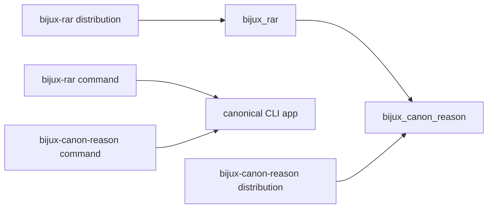

# Compatibility Commitments

The canonical distribution, import, and command are `bijux-canon-reason`,
`bijux_canon_reason`, and `bijux-canon-reason`.

`bijux-rar` is the synchronized compatibility distribution. It preserves the
`bijux_rar` import and `bijux-rar` command while executing the canonical package
implementation.

The alias forwards the canonical root export set, attribute access, discovery,
and runtime submodules. It is a naming bridge, not a separate reasoner or a
second artifact format.

## Stable Surfaces

Compatibility-sensitive surfaces include:

- root models and validation helpers listed in `bijux_canon_reason.__all__`;
- CLI commands, option meaning, exit behavior, and machine-readable output;
- v1 HTTP schemas and status semantics;
- trace event discriminators and typed step-output variants;
- content-ID, canonical JSON, and fingerprint algorithms; and
- run layout, manifest coverage, protocol versions, and replay comparison.

Private execution helpers, internal check implementations, and storage wiring
are not public merely because their modules can be imported.

## Versioned Evidence Is Independent

Package-name compatibility does not bypass evidence validation. A consumer must
still reject unsupported runtime protocol, schema, or canonicalization versions;
a mismatched manifest; a changed trace fingerprint; or an invalid support span.
The same rule applies whether the run was launched through the canonical or
legacy command.

## Migration

New work should use canonical names. Existing consumers can migrate safely by
changing the distribution, import, and command separately, then comparing a
fixed run:

1. verify both runs produce the same spec and plan IDs;
2. compare trace fingerprints and invariant checksums;
3. validate the complete manifests; and
4. inspect any replay diff rather than accepting filename equality.

See the [bijux-rar catalog entry](../../08-compat-packages/catalog/bijux-rar.md)
for installation and naming details.
