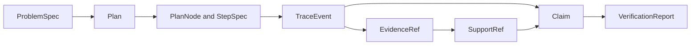

# Data Contracts

Reasoning output is modeled as a chain of typed, content-addressed records. A
claim is not a free-standing string: it belongs to a problem and plan, appears
in an ordered trace, points to exact support, and is evaluated by a verification
report.

## Planning Records

`ProblemSpec` captures the description, constraints, expected output type, and
optional expected values and version. Its ID is derived from canonical content
when none is supplied.

A `Plan` points back to the spec and contains ordered `PlanNode` values plus
explicit edges. Each node has a reasoning kind—`understand`, `gather`, `derive`,
`verify`, or `finalize`—dependencies, parameters, and a typed `StepSpec`.
`ToolRequest` keeps the selected tool and JSON-compatible arguments inside the
plan rather than hiding them in runtime glue.

## Trace Records

`Trace` declares runtime protocol, schema, canonicalization, and fingerprint
versions. Its event stream is a discriminated union:

| Event | Payload |
| --- | --- |
| `step_started` | step identity |
| `step_finished` | typed output for the step kind |
| `tool_called` | content-addressed call and arguments |
| `tool_returned` | call identity, success, result or error |
| `evidence_registered` | immutable evidence reference |
| `claim_emitted` | typed claim |

Finished steps cannot collapse to an arbitrary dictionary. Their output is one
of the understood, gathered, derived, verified, finalized, or
insufficient-evidence variants. This makes an explicit refusal for insufficient
evidence distinguishable from a malformed or missing result.

## Claims and Support

`Claim` records statement, status, confidence, type, optional structured data,
and support references. `SupportRef` identifies a claim, evidence item, or tool
call and requires both an exact byte span and a lowercase SHA-256 of the cited
snippet. `EvidenceRef` identifies its URI, whole-content hash, span, chunk, and
safe relative content path.

Evidence paths reject absolute paths, drive prefixes, backslashes, and parent
traversal. Span and hash validation occurs when records are constructed; cross-
record verification then confirms that cited bytes and registered evidence
agree.

## Verification Records

`VerificationReport` contains individual checks, structured failures, summary
metrics, and the trace identity. Failures retain severity and, when known, the
violated invariant. A report with failures is still valuable evidence; callers
must not reduce it to the presence of a JSON file or a truthy object.

All core records inherit the frozen `StableModel` contract: unknown fields are
forbidden, defaults are validated, aliases are resolved explicitly, and models
cannot be mutated after validation. Changing ID inputs, discriminators, event
order, span meaning, or version fields is compatibility-sensitive.

See [Artifact Contracts](artifact-contracts.md) for the canonical on-disk
representation of these records.
