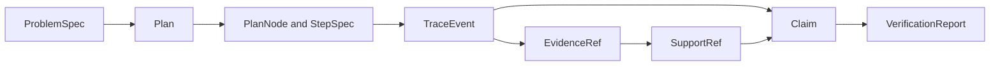

# Data Contracts

Reasoning output is modeled as a chain of typed, content-addressed records. A
claim is not a free-standing string: it belongs to a problem and plan, appears
in an ordered trace, points to exact support, and is evaluated by a verification
report.



## Planning Records

`ProblemSpec` captures the description, constraints, expected output type, and
optional expected values and version. Its ID is derived from canonical content
when none is supplied.

A `Plan` points back to the spec and contains ordered `PlanNode` values plus
explicit edges. Each node has a reasoning kind—`understand`, `gather`, `derive`,
`verify`, or `finalize`—dependencies, parameters, and a typed `StepSpec`.
`ToolRequest` keeps the selected tool and JSON-compatible arguments inside the
plan rather than hiding them in runtime glue.

## Trace Records

`Trace` declares runtime protocol, schema, canonicalization, and fingerprint
versions. Its event stream is a discriminated union:

| Event | Payload |
| --- | --- |
| `step_started` | step identity |
| `step_finished` | typed output for the step kind |
| `tool_called` | content-addressed call and arguments |
| `tool_returned` | call identity, success, result or error |
| `evidence_registered` | immutable evidence reference |
| `claim_emitted` | typed claim |

Finished steps cannot collapse to an arbitrary dictionary. Their output is one
of the understood, gathered, derived, verified, finalized, or
insufficient-evidence variants. This makes an explicit refusal for insufficient
evidence distinguishable from a malformed or missing result.

## Claims and Support

`Claim` records statement, status, confidence, type, optional structured data,
and support references. `SupportRef` identifies a claim, evidence item, or tool
call and requires both an exact byte span and a lowercase SHA-256 of the cited
snippet. `EvidenceRef` identifies its URI, whole-content hash, span, chunk, and
safe relative content path.

Evidence paths reject absolute paths, drive prefixes, backslashes, and parent
traversal. Construction validates support spans and snippet-hash syntax,
evidence spans, chunk-ID syntax, and path safety. `EvidenceRef.sha256` is carried
as a string at model construction; the run builder establishes its meaning by
hashing the referenced file and requiring an exact match. Cross-record
verification then confirms that cited bytes and registered evidence agree.

## Grounded Answer Citations

The credential-free grounded-answer path uses a closed chain of immutable
records rather than accepting citation dictionaries from a caller:

```text
retrieval artifact -> evidence packet -> normalized claim -> citation link
                   -> verification report -> evidence-aware admission
                   -> numbered presentation
```

Each citation link retains the exact retrieval, document, chunk, source,
locator, quote, and source-byte identities plus the source descriptor used for
bibliographic display. The verifier compares the link with both the evidence
packet and the source descriptor. An invented coordinate, changed quote, stale
retrieval identity, substituted source, or changed bibliography is a typed
failure.

`CitationPresentation` deduplicates repeated use of one evidence item while
retaining all claim identities that cite it. A numbered entry includes the
exact quote and locator, hashes, title, authors, journal, date, DOI, URI,
license, provenance, format, and language when the immutable source descriptor
provides them. An admitted factual claim without a verified citation is
invalid; an abstention exposes no claims or citations. Bibliographic metadata
helps a reader identify the source but is never treated as evidence for the
claim.

`GroundingEvidenceState` binds admission to the installed retrieval outcome,
VEX witness or bounded exact fallback, selected-evidence count, packet
completeness, and any policy or budget refusal. The versioned admission policy
also measures direct-support coverage and confidence and rejects unresolved
opposition. Its typed evidence gaps distinguish out-of-scope requests, absent
evidence, inadequate support, unresolved conflicts, unsafe or unverified
evidence, retrieval failure or refusal, and policy or budget refusal. Every gap
retains a concrete remediation. An upstream refusal therefore cannot be
converted into an answer merely because a downstream synthesizer can form a
sentence.

## Validation Layers

Validation is intentionally cumulative:

| Boundary | What it establishes | What it does not establish |
| --- | --- | --- |
| model construction | field shape, discriminators, span form, safe path syntax, content-derived IDs | file existence or semantic support |
| trace serialization | canonical header/event records and stable newline bytes | evidence-file integrity |
| run construction | registered file existence and whole-file SHA-256 equality | claim support correctness |
| trace verification | event order, references, spans, support hashes, plan and provenance relationships | external truth of a supported claim |
| manifest verification | retained file bytes match recorded digests | scientific or logical correctness |

A validated model can still name unavailable evidence. A manifest-valid run can
still contain rejected claims or failed verification checks. Consumers must use
the layer that answers their actual trust question.

## Verification Records

`VerificationReport` contains individual checks, structured failures, summary
metrics, and the trace identity. Failures retain severity and, when known, the
violated invariant. A report with failures is still valuable evidence; callers
must not reduce it to the presence of a JSON file or a truthy object.

All core records inherit the frozen `StableModel` contract: unknown fields are
forbidden, defaults are validated, aliases are resolved explicitly, and models
cannot be mutated after validation. Changing ID inputs, discriminators, event
order, span meaning, or version fields is compatibility-sensitive.

Content-derived IDs identify typed semantic records; they are not substitutes
for the exact-byte trace fingerprint or run manifest. Two serializations can
represent the same semantic record while differing at the byte layer, and the
artifact contract records both distinctions.

See [Artifact Contracts](artifact-contracts.md) for the canonical on-disk
representation of these records.
