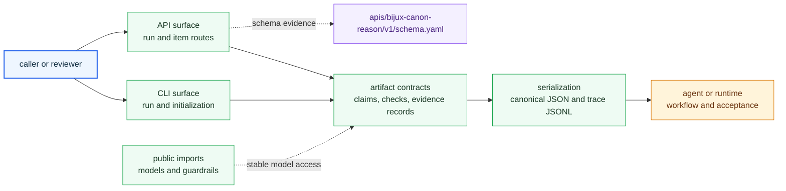

# Interfaces

Open this section when the question is contractual: which reasoning entrypoints, artifacts, payloads, and imports are real promises rather than merely visible implementation details.

## Contract Surface

Reason interfaces are reviewer-facing contracts. They expose how callers start
a reasoning run, what artifact shapes come back, how provenance and checks are
serialized, and which public imports are stable enough for downstream packages
to use without copying internal policy.

## Read These First

- open [Data Contracts](https://bijux.io/bijux-canon/04-bijux-canon-reason/interfaces/data-contracts/) first when the issue is about claim, check, or provenance payload shape
- open [Artifact Contracts](https://bijux.io/bijux-canon/04-bijux-canon-reason/interfaces/artifact-contracts/) when downstream tools depend on stable reasoning outputs
- open [Compatibility Commitments](https://bijux.io/bijux-canon/04-bijux-canon-reason/interfaces/compatibility-commitments/) when a reasoning-surface change may break reviewers or callers

## Contract Risk

The main contract risk here is letting reviewer-facing reasoning artifacts drift without naming which shapes and entrypoints are actually supported.

## First Proof Check

- `packages/bijux-canon-reason/src/bijux_canon_reason/interfaces` for CLI, serialization, and access guard boundaries
- `packages/bijux-canon-reason/src/bijux_canon_reason/api/v1` for HTTP route and OpenAPI model surfaces
- `apis/bijux-canon-reason/v1/schema.yaml` for tracked schema visibility
- `packages/bijux-canon-reason/tests` for claim, provenance, and compatibility evidence

## Pages In This Section

- [CLI Surface](https://bijux.io/bijux-canon/04-bijux-canon-reason/interfaces/cli-surface/)
- [API Surface](https://bijux.io/bijux-canon/04-bijux-canon-reason/interfaces/api-surface/)
- [Configuration Surface](https://bijux.io/bijux-canon/04-bijux-canon-reason/interfaces/configuration-surface/)
- [Data Contracts](https://bijux.io/bijux-canon/04-bijux-canon-reason/interfaces/data-contracts/)
- [Artifact Contracts](https://bijux.io/bijux-canon/04-bijux-canon-reason/interfaces/artifact-contracts/)
- [Entrypoints and Examples](https://bijux.io/bijux-canon/04-bijux-canon-reason/interfaces/entrypoints-and-examples/)
- [Operator Workflows](https://bijux.io/bijux-canon/04-bijux-canon-reason/interfaces/operator-workflows/)
- [Public Imports](https://bijux.io/bijux-canon/04-bijux-canon-reason/interfaces/public-imports/)
- [Compatibility Commitments](https://bijux.io/bijux-canon/04-bijux-canon-reason/interfaces/compatibility-commitments/)

## Leave This Section When

- leave for [Foundation](https://bijux.io/bijux-canon/04-bijux-canon-reason/foundation/) when the contract dispute is really a package-boundary dispute
- leave for [Architecture](https://bijux.io/bijux-canon/04-bijux-canon-reason/architecture/) when a surface question reveals structural drift underneath it
- leave for [Operations](https://bijux.io/bijux-canon/04-bijux-canon-reason/operations/) or [Quality](https://bijux.io/bijux-canon/04-bijux-canon-reason/quality/) when the boundary is clear and the question becomes execution or proof

## Bottom Line

A surface is not a real contract until the docs, code, and tests agree that it is one.
