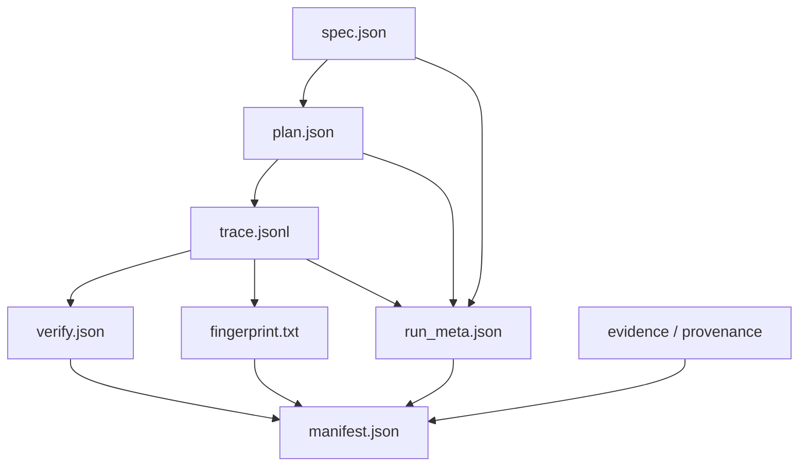

# Interfaces

Reason interfaces expose both execution and review. A caller can create a run,
while a reviewer can inspect its plan, typed trace, findings, provenance,
fingerprints, and manifest without depending on private Python objects.

## Surface map

| Surface | Use | Contract |
| --- | --- | --- |
| Python | embed planning, execution, verification, and replay | immutable typed models, runtime protocols, readers, and workflows |
| CLI | create, verify, replay, evaluate, and scaffold specifications | exit status plus JSON or file artifacts |
| HTTP v1 runs | create and inspect file-backed reasoning runs | run metadata, manifest, trace, verification, and replay operations |
| HTTP v1 items | lightweight soft-deleted item state | numeric identity, name, description, and documented restore behavior |
| Run directory | retain reasoning evidence | core files, optional evidence/provenance, replay output |
| OpenAPI schema | generate and validate clients | versioned route and payload vocabulary |

## Run artifact relationship

```mermaid
flowchart TD
    spec["spec.json"] --> plan["plan.json"]
    plan --> trace["trace.jsonl"]
    trace --> verify["verify.json"]
    trace --> fingerprint["fingerprint.txt"]
    spec --> metadata["run_meta.json"]
    plan --> metadata
    trace --> metadata
    verify --> manifest["manifest.json"]
    fingerprint --> manifest
    metadata --> manifest
    provenance["evidence / provenance"] --> manifest
```

The files protect different properties. The semantic trace ID, byte-level
trace fingerprint, plan/evidence/runtime invariant checksum, and per-file
manifest digests overlap deliberately but are not interchangeable. The
manifest is internally consistent, not self-authenticating.

## Inspect a run without executing it

A reviewer does not need the original provider or tool process to reject a
malformed reasoning record. Open the bundle in this order:

| Inspection | Evidence to compare | Stop or qualify when |
| --- | --- | --- |
| containment | run root, safe relative paths, manifest membership | a referenced file escapes the root or an unexpected file is treated as governed evidence |
| problem and plan | `spec.json`, `plan.json`, their stable IDs and DAG topology | the plan addresses another problem, contains a cycle, or names missing work |
| execution history | typed records in `trace.jsonl` and their causal links | an action, tool call, evidence load, or claim transition is orphaned or unfinished |
| support | evidence identity, exact span, snippet bytes and digest | the citation is nearby but not byte-identical, or the evidence snapshot is unavailable |
| verification | `verify.json`, registered checks, findings and claim status | a report is missing, partial, stale, or inconsistent with the trace |
| closure | `run_meta.json`, `fingerprint.txt`, invariant checksum and `manifest.json` digests | individually valid files do not form one content-addressed run |
| replay | frozen inputs, replay output, diff and mismatch policy | live retrieval replaced retained evidence or completion is mistaken for a match |

This order separates safe parsing, structural integrity, evidentiary support,
and behavioral review. A manifest digest can prove which bytes were retained;
it cannot prove that the source was authoritative or the inference was sound.

## Automation semantics

- `run` writes the bundle even when verification finds failures unless
  `--fail-on-verify` promotes them to exit `2`; automation must inspect the
  report in either case.
- JSON `verify` exits `2` when findings exist. The separately invoked command
  writes `verify.verify.json`, not the original run-time `verify.json`.
- Replay comparison completing is not the same as fingerprints matching. CLI
  mismatch policy and HTTP response status must be interpreted with the diff.
- HTTP item request models currently accept fields that are not persisted;
  only documented returned fields are durable item metadata.
- Trace and manifest readers reject unsafe relative paths and malformed
  records rather than normalizing them silently.

## Reconcile interface verdicts

Reason exposes several outcomes because execution, verification, integrity,
and replay answer different questions. Keep them separate when automating a
review:

| Observation | Authority | Meaning |
| --- | --- | --- |
| command exit status | CLI invocation | whether that command completed under its selected failure policy |
| claim status and findings | reasoning and verification records | whether registered support and checks admit, qualify, or reject a claim |
| manifest and fingerprint checks | run-bundle readers | whether the retained files still form the recorded content-addressed run |
| replay diff and mismatch policy | replay operation | whether retained inputs and tool returns reconstruct an acceptable trace |
| HTTP status and response body | versioned service boundary | whether the requested route accepted and completed its operation |

These verdicts may legitimately differ. `run` can exit successfully while
`verify.json` contains findings; a bundle can be byte-integral while its claim
is rejected; replay can reconstruct a rejected run; and a newly invoked
verification can produce `verify.verify.json` without rewriting the original
run-time report. Preserve the filenames, timestamps, check registry, and
invocation policy needed to explain which verdict is being cited.

When evidence conflicts, trust the narrowest owning record: file digests for
retained-byte identity, verification findings for registered checks, the claim
status for reasoning disposition, and replay output for reconstruction. No
single top-level “success” field supersedes all four.

## Contract index

| Need | Guide |
| --- | --- |
| Operate `run`, `verify`, `replay`, or `eval` | [CLI surface](cli-surface.md) |
| Integrate item and run routes | [API surface](api-surface.md) |
| Configure roots, guards, budgets, and retrieval | [Configuration surface](configuration-surface.md) |
| Construct specs, plans, evidence, claims, and traces | [Data contracts](data-contracts.md) |
| Validate or export a run directory | [Artifact contracts](artifact-contracts.md) |
| Compose package modules directly | [Public imports](public-imports.md) |
| Follow end-to-end caller journeys | [Operator workflows](operator-workflows.md) |
| Assess schema or artifact evolution | [Compatibility commitments](compatibility-commitments.md) |
| Start from executable examples | [Entrypoints and examples](entrypoints-and-examples.md) |
