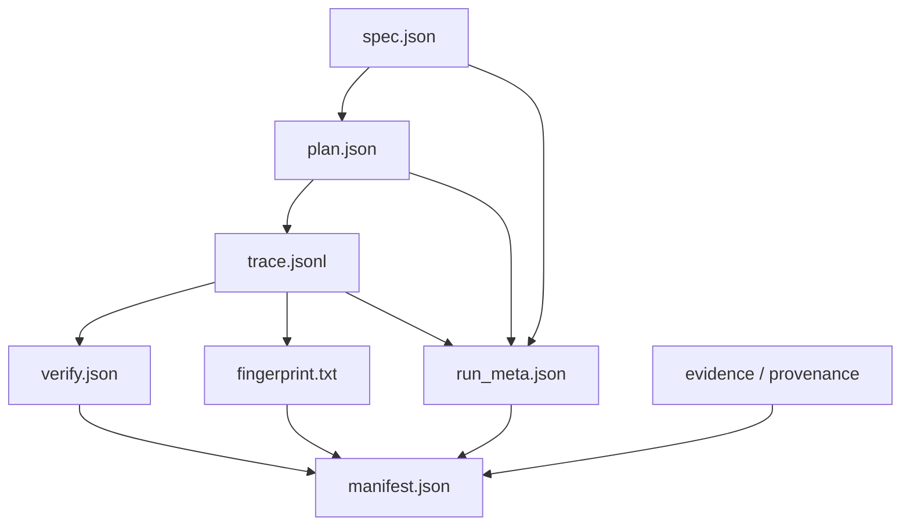

# Interfaces

Reason interfaces expose both execution and review. A caller can create a run,
while a reviewer can inspect its plan, typed trace, findings, provenance,
fingerprints, and manifest without depending on private Python objects.

## Surface map

| Surface | Use | Contract |
| --- | --- | --- |
| Python | embed planning, execution, verification, and replay | immutable typed models, runtime protocols, readers, and workflows |
| CLI | create, verify, replay, evaluate, and scaffold specifications | exit status plus JSON or file artifacts |
| HTTP v1 runs | create and inspect file-backed reasoning runs | run metadata, manifest, trace, verification, and replay operations |
| HTTP v1 items | lightweight soft-deleted item state | numeric identity, name, description, and documented restore behavior |
| Run directory | retain reasoning evidence | core files, optional evidence/provenance, replay output |
| OpenAPI schema | generate and validate clients | versioned route and payload vocabulary |

## Run artifact relationship

```mermaid
flowchart TD
    spec["spec.json"] --> plan["plan.json"]
    plan --> trace["trace.jsonl"]
    trace --> verify["verify.json"]
    trace --> fingerprint["fingerprint.txt"]
    spec --> metadata["run_meta.json"]
    plan --> metadata
    trace --> metadata
    verify --> manifest["manifest.json"]
    fingerprint --> manifest
    metadata --> manifest
    provenance["evidence / provenance"] --> manifest
```

The files protect different properties. The semantic trace ID, byte-level
trace fingerprint, plan/evidence/runtime invariant checksum, and per-file
manifest digests overlap deliberately but are not interchangeable. The
manifest is internally consistent, not self-authenticating.

## Automation semantics

- `run` writes the bundle even when verification finds failures unless
  `--fail-on-verify` promotes them to exit `2`; automation must inspect the
  report in either case.
- JSON `verify` exits `2` when findings exist. The separately invoked command
  writes `verify.verify.json`, not the original run-time `verify.json`.
- Replay comparison completing is not the same as fingerprints matching. CLI
  mismatch policy and HTTP response status must be interpreted with the diff.
- HTTP item request models currently accept fields that are not persisted;
  only documented returned fields are durable item metadata.
- Trace and manifest readers reject unsafe relative paths and malformed
  records rather than normalizing them silently.

## Contract index

| Need | Guide |
| --- | --- |
| Operate `run`, `verify`, `replay`, or `eval` | [CLI surface](cli-surface.md) |
| Integrate item and run routes | [API surface](api-surface.md) |
| Configure roots, guards, budgets, and retrieval | [Configuration surface](configuration-surface.md) |
| Construct specs, plans, evidence, claims, and traces | [Data contracts](data-contracts.md) |
| Validate or export a run directory | [Artifact contracts](artifact-contracts.md) |
| Compose package modules directly | [Public imports](public-imports.md) |
| Follow end-to-end caller journeys | [Operator workflows](operator-workflows.md) |
| Assess schema or artifact evolution | [Compatibility commitments](compatibility-commitments.md) |
| Start from executable examples | [Entrypoints and examples](entrypoints-and-examples.md) |
