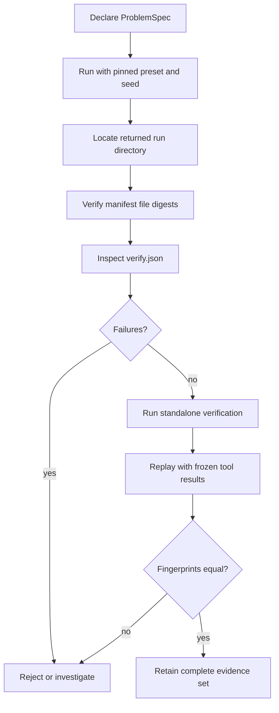

# Operator Workflows

The safest operating unit is the complete run directory. A final answer alone
cannot establish which plan ran, which evidence supported each claim, whether
verification passed, or whether the execution can be replayed.



## Produce a governed run

Create `problem.json`:

```json
{
  "description": "Determine the retention period supported by the evidence.",
  "constraints": {
    "require_citation": true
  },
  "expected_output_type": "Claim",
  "expected": {
    "subject": "signed run records"
  },
  "version": 1
}
```

Run with an explicit artifact root and verification gate:

```bash
bijux-canon-reason run \
  --spec problem.json \
  --preset default \
  --seed 0 \
  --artifacts-dir artifacts/bijux-canon-reason \
  --fail-on-verify \
  --json
```

Capture `run_dir` from the JSON response. The directory name is derived from
the specification identity, preset, seed, and runtime fingerprint, so the same
identified inputs address the same run location. Omit `id` to have the model
derive a content identifier; an explicitly supplied `id` is preserved and
therefore places identity responsibility on the caller. Retain the input file
used by the caller as well as `spec.json` written into the run.

## Validate the bundle before accepting claims

Acceptance has three separate layers.

### File integrity

For every entry in `manifest.json`:

1. resolve the path relative to the run directory;
2. reject absolute paths or paths that escape the run directory;
3. require the file to exist;
4. compute SHA-256 over its bytes;
5. compare the digest with the manifest value.

`manifest.json` is an inventory of the initially written bundle. It does not
list itself, and files written later—such as `verify.verify.json` and
`replay/trace.jsonl`—are not retroactively added.

### Reasoning invariants

Read `verify.json` before consuming claims. A usable report has no failures and
contains the checks expected by the governing policy. To evaluate the current
implementation independently, run:

```bash
bijux-canon-reason verify \
  --trace "$RUN_DIR/trace.jsonl" \
  --plan "$RUN_DIR/plan.json" \
  --fail-on-verify \
  --json
```

Compare `verify.verify.json` with the original `verify.json` when investigating
version drift. Do not overwrite the original report: it records what the run
producer concluded at creation time.

### Deterministic reconstruction

```bash
bijux-canon-reason replay \
  --trace "$RUN_DIR/trace.jsonl" \
  --fail-on-diff \
  --json
```

Replay rejects a changed plan, trace, or runtime descriptor through the
invariant checksum. It reconstructs tool returns from the original trace,
writes `replay/trace.jsonl`, and compares canonical trace fingerprints. For a
retrieval-backed run it also requires the recorded corpus, BM25 index, and
retrieval provenance to match their pinned digests.

Replay does not validate `manifest.json`. Whole-bundle digest checking and
reasoning replay are complementary acceptance steps, not substitutes.

## Investigate failures in causal order

Start with the earliest broken layer:

1. malformed or missing files;
2. manifest digest mismatch;
3. specification, plan, or trace schema failure;
4. plan topology and step ordering;
5. tool-call/result linkage;
6. evidence file digest, chunk, or span mismatch;
7. claim support and grounding failure;
8. finalization or insufficient-evidence policy;
9. replay checksum or fingerprint mismatch.

Later findings can be consequences of earlier faults. An unsupported claim
caused by a missing tool result should not be repaired by editing the claim in
place. Preserve the failed bundle, correct the input or implementation, and
produce a new governed run.

## Operate retrieval-backed reasoning

Set `constraints.needs_retrieval` to `true` and provide a `corpus_path` when
the run must gather local evidence. Retrieval constraints can also pin
`chunk_chars`, `overlap_chars`, `bm25_k1`, and `bm25_b`.

The resulting bundle may contain:

- `provenance/corpus.jsonl`;
- `provenance/index/bm25_index.json`;
- `provenance/retrieval_provenance.json`;
- content-addressed files beneath `evidence/`.

Do not move only `trace.jsonl`: replay resolves these artifacts relative to the
trace directory. Archive the entire run directory as one evidence unit.

## Evaluate a pinned suite

Place one JSON `ProblemSpec` per line in
`tooling/evaluation_suites/<suite>/problems.jsonl`, then run:

```bash
bijux-canon-reason eval \
  --suite small \
  --preset default \
  --seed 0 \
  --artifacts-dir artifacts/bijux-canon-reason \
  --json
```

Retain the suite input alongside `eval/<suite>/cases.jsonl` and
`eval/<suite>/summary.json`. A suite passes only when every case's verification
report has no failures. Treat the emitted alignment, faithfulness, recall, and
reciprocal-rank fields according to their implementation: they summarize
support counts and evidence presence and do not replace externally labeled
quality measurements.

## Retention set

For every result used outside its originating process, retain:

- original input and canonical `spec.json`;
- `plan.json`, `trace.jsonl`, and `fingerprint.txt`;
- `verify.json` and any later `verify.verify.json`;
- `run_meta.json` and `manifest.json`;
- all evidence and provenance files;
- `replay/trace.jsonl` plus the replay JSON result;
- package version and the environment used to perform independent checks.

This set supports separate challenges to input identity, execution order,
evidence grounding, verification policy, artifact integrity, and replay.
