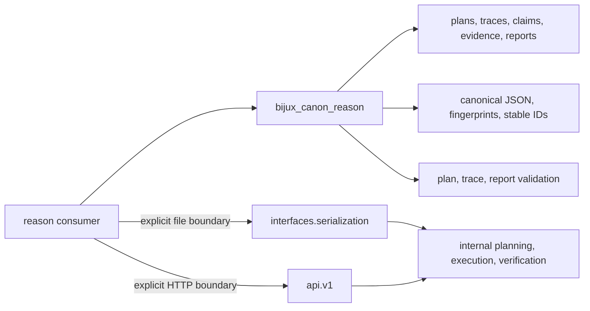

# Public Imports

The package root exposes the stable reasoning model and its identity and
validation helpers. Prefer it for constructing or reading specs, plans, traces,
claims, evidence, and verification reports.

## Public Surface Architecture



The root is intentionally evidence-oriented. It lets a consumer construct,
validate, identify, and inspect reasoning records without importing a concrete
planner, tool runtime, verifier implementation, or CLI.

## Root Surface

| Concern | Root imports |
| --- | --- |
| problem and plan | `ProblemSpec`, `Plan`, `PlanNode`, `StepSpec`, `ToolRequest` |
| runtime identity | `RuntimeDescriptor`, `ToolDescriptor` |
| tool execution | `ToolCall`, `ToolResult` |
| trace | `Trace`, `TraceEvent`, `TraceEventKind`, `StepOutput` |
| evidence and claims | `EvidenceRef`, `SupportRef`, `SupportKind`, `Claim` |
| verification | `VerificationCheck`, `VerificationReport` |
| grounded citations | `CitationSourceDescriptor`, `ClaimCitationSet`, `CitationVerificationReport`, `CitationPresentation`, `PresentedCitation` |
| identity | `canonical_dumps`, `fingerprint_bytes`, `fingerprint_obj`, `stable_id` |
| invariants | `validate_plan`, `validate_trace`, `validate_verification_report` |

The root and `bijux_canon_reason.core` expose the same supported record and
identity vocabulary. Prefer the root for ordinary consumers; use `core` only
when an explicit domain namespace improves local architecture.

## Construct Content-Addressed Records

```python
from bijux_canon_reason import Plan, PlanNode, ProblemSpec, StepSpec, validate_plan

spec = ProblemSpec(description="Which retained evidence supports the claim?")
node = PlanNode(
    kind="gather",
    step=StepSpec(kind="gather"),
)
plan = Plan(
    spec_id=spec.id,
    problem=spec.description,
    nodes=[node],
).with_content_id()

errors = validate_plan(plan)
if errors:
    raise ValueError(errors)
```

IDs are derived from canonical content. Build the complete record first; a
content change intentionally produces a different identity.

Content addressing is a semantic boundary:

- canonical JSON determines the bytes that are fingerprinted;
- fingerprint algorithm and canonicalization version constrain comparison;
- plan, trace, and evidence changes are expected to change derived identities;
- matching filenames or user-supplied labels do not establish content
  identity.

Do not mutate a content-addressed record and retain its previous ID. Construct
the revised record and derive a new identity.

## Boundary Imports

Use explicit public namespaces when opting into an interface rather than a core
record:

```python
from bijux_canon_reason.api.v1 import create_app
from bijux_canon_reason.interfaces.serialization import (
    read_trace_jsonl,
    write_trace_jsonl,
)
```

The serialization namespace owns stable JSON and trace-file boundaries. The API
namespace owns the FastAPI application. Execution internals, individual check
modules, and CLI implementation modules should not be imported as library APIs.

## Import By Responsibility

| Responsibility | Supported import | Required evidence |
| --- | --- | --- |
| construct or inspect reasoning records | package root | model validation and invariant checks |
| derive question-specific answer requirements | `AnswerRequirementPlanningService` from the package root | grounded claims, semantic verdicts, admission gaps, exact prior skeptical-search closure, and content-addressed plan validation |
| execute, inspect, verify, replay, or compare bounded research | `ResearchApplicationService` from the package root | manifested record, exact restart verification, and attributed attempt comparison |
| generate or compare stable identities | package root | canonicalization version, algorithm, and fixed-vector tests |
| read or write canonical JSON and trace JSONL | `interfaces.serialization` | byte-level round trip and trace fingerprint |
| host the versioned HTTP application | `api.v1` | pinned OpenAPI and route/error contracts |
| execute a complete reason workflow | documented application or CLI boundary | artifacts, manifest coverage, verification, and replay evidence |

Model validation and semantic validation are distinct. A model can satisfy its
field types while `validate_plan`, `validate_trace`, or
`validate_verification_report` reports cross-record violations.

## Avoid Accidental APIs

Do not import individual verification checks, planner or executor classes,
tool-dispatch internals, run-artifact helpers, API route modules, or CLI parser
functions as library contracts. Their observable results are governed through
the public models, validation functions, serialization boundary, API schema,
and application behavior.

When upgrading, inventory imports separately from persisted records. Root API
tests establish code compatibility; trace schema, runtime protocol,
canonicalization, fingerprints, manifests, and evidence spans require their
own validation and replay evidence.

`bijux_rar` forwards the canonical root and submodules for compatibility. New
code should import `bijux_canon_reason`; see
[Compatibility Commitments](compatibility-commitments.md) for migration rules.
