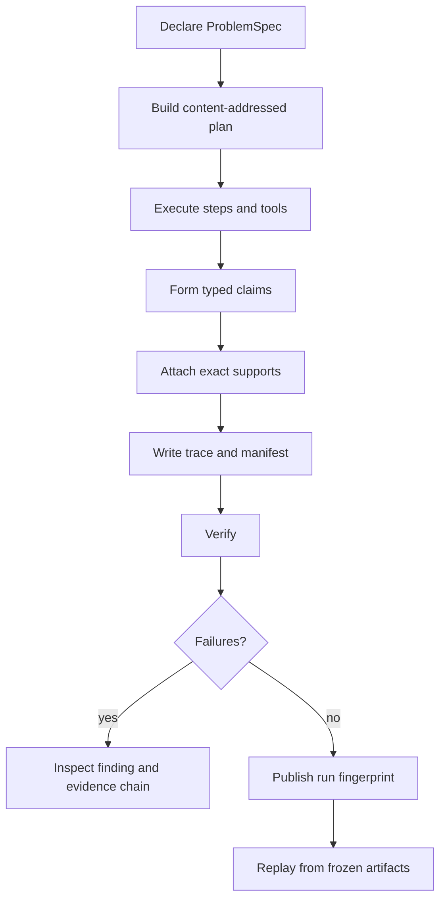

# Common Workflows

A reason run is complete only when its claims can be traced to exact support
and its artifacts pass verification. The normal workflow preserves that chain
from problem declaration through replay.

## Produce an auditable claim

1. Write one unambiguous problem description and explicit constraints.
2. State the expected output type; add expected structure only when it is part
   of the acceptance contract.
3. Select a preset and record a deterministic seed.
4. Keep evidence under the governed artifact boundary so support paths can be
   resolved safely.
5. Run with `--fail-on-verify` when downstream work must not consume a run with
   verification findings.
6. Retain the full run directory, not only the final claim or trace fingerprint.

Changing the description, constraints, expectation, or version changes the
content-derived specification identity. That is a new reasoning input, not a
replay of the old one.

## Investigate a verification failure

Read findings from structural to semantic causes:

1. plan topology and trace event invariants;
2. tool-call and tool-result linkage;
3. claim support references;
4. evidence and reasoning grounding;
5. insufficient-evidence handling;
6. finalization and required actions;
7. evidence digests and exact support spans.

Repair the earliest broken invariant first. A missing tool result can produce
later unsupported claims, and editing only those claims would conceal the
original execution defect. Re-run verification after repair and preserve the
failed report when it is part of an audit trail.

## Replay without reinterpreting history

Replay reconstructs the reasoning path from frozen artifacts and recorded tool
results. It checks the invariant checksum, validates retrieval provenance when
present, emits a replay trace, and compares its canonical fingerprint with the
original. It does not read `manifest.json`; verify the manifest's file digests
as a separate whole-bundle integrity check.

A fingerprint mismatch means the reconstructed event record differs. Inspect
the diff summary, producer and schema versions, runtime fingerprint, plan,
trace, and manifest before deciding whether the cause is corruption, an
incompatible implementation, or an intentionally changed input. Do not label a
mismatch as equivalent because the final prose appears similar.

## Expose run lifecycle over HTTP

The API stores runs beneath the application artifact root. Operators should:

- configure a durable mounted location for that root;
- use the optional API token and rate limit when the service crosses a trusted
  process boundary;
- retain the run identifier returned at creation;
- retrieve the manifest before moving or archiving a run;
- call verify before exposing a result to another system;
- treat request-size, response-size, and path guards as contract boundaries.

The item CRUD endpoints are lightweight package-owned state. They are not a
substitute for reasoning run artifacts or runtime-wide persistence.

## Use evaluation with its current boundary

The `eval` command runs the package's implemented suite workflow and writes a
summary artifact. Its `--suite` selector is still described by the interface as
a placeholder for a future catalog, so do not claim that arbitrary named
suites are supported. For release or research evidence, inspect the actual
cases executed and retain the summary with the producer version and seed.

## Preserve the reasoning evidence set

For every result used outside the originating process, preserve:

- the canonical problem specification and its identifier;
- plan, dependency graph, and plan identifier;
- complete JSONL trace and fingerprint;
- evidence files and exact support references;
- verification report, including failures;
- runtime descriptor, producer version, and schema version;
- manifest and invariant checksum;
- replay trace and diff summary when replay is claimed.

The evidence set makes it possible to challenge a claim at the support,
reasoning, execution, or reproducibility layer without reconstructing intent
from final prose.
