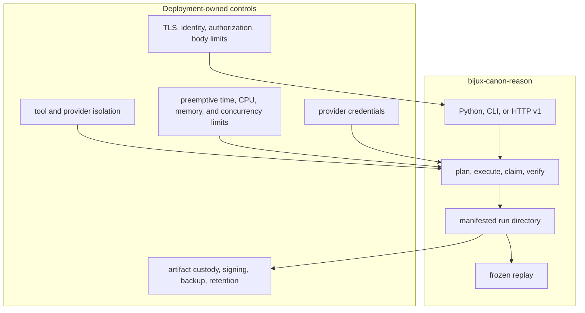

# Deployment Boundaries

Reason can run as a Python component, a file-oriented CLI, or a FastAPI
application rooted in a controlled artifact directory. It creates auditable
reasoning evidence. The deployment owns user identity, isolation, provider
credentials, preemptive resource enforcement, and the retention of sensitive
source material.

## Responsibility boundary

## Deployment shapes

| Shape | Use | Boundary |
| --- | --- | --- |
| Embedded Python | An application supplies a controlled runtime and consumes typed artifacts | The caller owns runtime resources, cancellation, and artifact-root lifecycle |
| File-backed CLI | Reproducible run, verify, and replay workflows | Treat the complete run directory as the output; final text alone is incomplete |
| HTTP v1 | Item and run lifecycle behind an application service | The optional shared token and process-local rate counter are not a production identity or distributed quota system |

`bijux-rar` is a compatibility command and does not change these deployment
responsibilities.

## Artifact and state topology

Each run resides beneath the configured artifact root with core files,
provenance, registered evidence, and a manifest. The HTTP application also
keeps its SQLite item store beneath that root. Filesystem permissions,
encryption, capacity, backup, restore, tenant namespaces, external signatures,
and deletion policy belong to the deployer.

Internal digests detect changed bytes but do not authenticate the producer.
When a run crosses a trust boundary, bind the manifest to a trusted digest or
signature outside the run directory.

## Resource and effect limits

Corpus bytes and aggregate run-disk use can be bounded through environment
configuration. Current elapsed-time and CPU budgets are checked after
execution returns; they are not cancellation or sandbox controls. A shared or
hostile environment therefore needs process, container, queue, or worker-level
limits that can terminate work safely.

Tool runtimes may have network, filesystem, model, or subprocess authority.
Run untrusted tools out of process, constrain egress and credentials, classify
failures, and retain tool identity without recording secrets.

## Production controls

A production deployment provides:

- TLS, strong identity, per-operation authorization, and tenant isolation;
- independently enforced request-body, response, list, and path limits;
- preemptive time, CPU, memory, disk, concurrency, and queue budgets;
- secret injection and provider-specific egress policy;
- immutable or access-controlled evidence and run storage;
- atomic publication rules that expose a run only after the core set and
  manifest are complete;
- monitoring for tool failures, verification failures, manifest mismatch,
  quota exhaustion, path rejection, incomplete runs, and replay differences;
- retention and deletion policy for prompts, corpora, evidence bytes, claims,
  traces, provider output, and audit logs.

## Deployment acceptance

Exercise clean-environment installation, run creation, manifest verification,
export/import, frozen replay, process restart, and restore. Test malformed
paths, changed evidence bytes, absent tool recordings, oversized corpora,
provider failure, and authorization failure. A deployment is safe only when
these cases produce explicit refusal without leaking evidence or credentials.

The [artifact contract](../interfaces/artifact-contracts.md) defines the state
that must remain intact. The [security guide](security-and-safety.md) covers
evidence integrity and HTTP limitations in detail.
