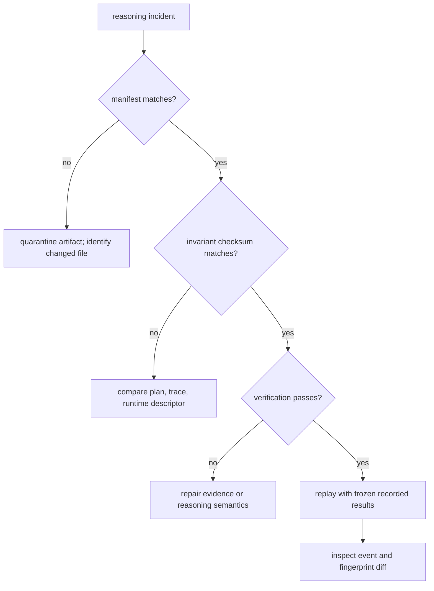

# Failure Recovery

Recover from retained evidence, beginning with integrity and then moving toward
reasoning semantics. Re-running before preserving the original directory can
erase the only useful distinction between a damaged artifact and a changed
execution.

## Preserve and Classify

Copy or archive the complete run directory before repair. Record the package
version and the exact command policy, including preset, seed, artifact root,
and whether verification or replay differences were configured to fail the
command.

Classify the incident by the earliest failed boundary:

| Boundary | Evidence | Typical failure |
| --- | --- | --- |
| input | `spec.json` | invalid shape or changed content identity |
| planning | `plan.json` | missing dependency, action, or tool request |
| execution | `trace.jsonl` | unmatched call/result, failed tool, incomplete action |
| grounding | evidence and provenance files | missing bytes, hash drift, invalid support span |
| verification | `verify.json` | invariant, linkage, or finalization failure |
| packaging | `manifest.json`, `fingerprint.txt` | altered, absent, or untracked artifact |
| replay | `replay/trace.jsonl` and diff | checksum, provenance, event, or fingerprint divergence |

## Integrity Before Replay

Recompute file hashes against `manifest.json`. Then compare the trace bytes with
`fingerprint.txt` and the plan/trace/runtime checksum with the value in
`run_meta.json`. A failed integrity check is not a reasoning disagreement; it is
artifact corruption or mutation.

## Verification Failures

Use the failed check name and invariant ID to narrow the repair:

- tool linkage failures require matching calls, results, and action IDs;
- claim-support failures require an existing referenced claim, evidence item,
  or tool call;
- grounding failures require the policy's minimum evidence for derived claims;
- finalization failures mean rejected or unvalidated claims reached the final
  output;
- evidence-hash failures require restoring the pinned bytes or producing a new
  run; and
- support-span failures require correcting both the byte interval and its
  snippet hash.

Do not edit a completed trace or manifest to make verification pass. Correct
the input, plan, runtime, or evidence producer and create a new content-addressed
run. The failed directory remains useful incident evidence.

## Replay Failures

Replay requires `spec.json`, `plan.json`, `run_meta.json`, and the original
trace. Retrieval-backed runs additionally require the pinned corpus, BM25
index, and retrieval provenance with hashes matching trace metadata.

If replay refuses before execution, restore the missing artifact or classify
the run as non-replayable. If execution completes but fingerprints differ,
inspect the structured trace diff by event order, tool result, claim content,
and metadata. A mismatch with equal visible final text is still a reproducibility
failure because the proof path changed.

## Recovery Exit Criteria

Recovery produces a new run for which:

- every manifest entry matches its file;
- the stored trace fingerprint matches the trace bytes;
- the invariant checksum covers the retained plan, trace, and runtime;
- verification has no failures under the intended policy;
- replay uses pinned recorded results and retrieval artifacts; and
- original and replayed trace fingerprints match when strict replay is
  required.

The failed run remains unchanged and can be retained alongside the corrected
run for audit comparison.
