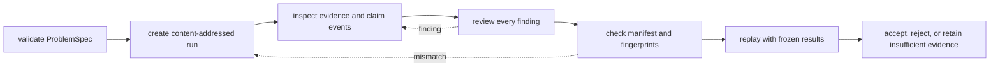

# Operations

Operate a reasoning run as a chain of evidence, not as a command that happened
to exit. Acceptance requires the intended specification and plan, a trace with
resolvable support, an inspected verification report, and a run whose digests
still match its retained files.

## Review lifecycle

## Acceptance evidence

| Evidence | Acceptance question |
| --- | --- |
| `spec.json` | Is this the intended problem, constraint set, and output type? |
| `plan.json` | Is the dependency graph complete and content identity stable? |
| `trace.jsonl` | Can each call, result, evidence item, claim, and action be followed in order? |
| `verify.json` | Which checks passed, warned, or failed, and under which invariant IDs? |
| `fingerprint.txt` | Do the exact serialized trace bytes still match? |
| `run_meta.json` | Which preset, seed, runtime, tools, schema, and producer created the run? |
| `manifest.json` | Do all declared core, evidence, and provenance files match their digests? |
| replay diff | Does the frozen execution reproduce the retained trace under the recorded contract? |

## Keep operational verdicts separate

One run can have different answers to each of these questions:

| Verdict | Governing evidence | Operational meaning |
| --- | --- | --- |
| execution completion | plan nodes and terminal trace events | the declared work reached a terminal outcome |
| claim disposition | typed claim status and its support relationships | the claim is proposed, validated, rejected, or retained as insufficient |
| verification result | registered findings, severities and policy choice | structural and grounding checks passed, warned, or failed |
| bundle integrity | manifest, fingerprints, invariant checksum and safe paths | the retained files still form the content-addressed run |
| replay comparison | frozen inputs, replay trace, diff, verdict and reason | the later execution matches or diverges under the recorded contract |
| process status | command exit code and selected strictness flags | automation received the documented process-level signal |

Do not derive one verdict from another. A command may exit successfully while
retaining verification findings; a valid bundle may contain an insufficient
claim; and replay can diverge even when both executions terminate normally.
Acceptance policy must name which verdicts it requires and retain all of them.

## Failure routing

| Symptom | Inspect first | Safe response |
| --- | --- | --- |
| Verification findings with exit `0` | `verify.json` and whether strict failure policy was requested | do not accept the run based on exit status alone |
| Support hash or span failure | exact retained evidence bytes and registered interval | restore the original evidence or reject the claim; never update only the digest |
| Manifest mismatch | changed, missing, and unexpectedly relocated files | quarantine the bundle and recover from a trusted copy |
| Replay checksum failure | original plan, evidence order, runtime descriptor, and pinned retrieval provenance | refuse equivalence before re-execution |
| Replay trace differs | structural diff and recorded tool returns | identify the changed contract or implementation; similar prose is insufficient |
| Retrieval evidence is weak or absent | corpus, chunks, BM25 provenance, and `insufficient_evidence` events | improve the declared evidence path or preserve the controlled refusal |
| Resource guard stops a run | disk, wall-time, CPU, or corpus limit | treat partial output as incomplete and rerun under an explicit safe budget |

## Deployment boundary

The API offers an optional exact token, request-size guards, and an in-process
rate counter. These are not distributed authentication, tenant isolation,
malware screening, sandboxing, or secret management. Process resource budgets
are guardrails, not a scheduler or hard real-time boundary. Apply production
controls in the hosting system and authenticate exported manifests externally.

## Operate by need

| Need | Guide |
| --- | --- |
| Install the command and API extras | [Installation and setup](installation-and-setup.md) |
| Develop with isolated artifacts | [Local development](local-development.md) |
| Create, verify, replay, and evaluate runs | [Common workflows](common-workflows.md) |
| Diagnose claims, checks, provenance, and replay | [Observability and diagnostics](observability-and-diagnostics.md) |
| Plan corpus and resource bounds | [Performance and scaling](performance-and-scaling.md) |
| Recover a corrupt or divergent run | [Failure recovery](failure-recovery.md) |
| Define hosting controls | [Security and safety](security-and-safety.md) and [Deployment boundaries](deployment-boundaries.md) |
| Release an artifact- or schema-sensitive change | [Release and versioning](release-and-versioning.md) |
