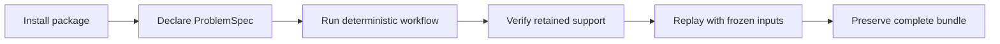

# Installation and Setup

`bijux-canon-reason` supports Python 3.11 through 3.14. Its core reasoning,
verification, CLI, and deterministic retrieval path do not require an external
LLM provider.



## Install

```bash
python -m venv .venv
source .venv/bin/activate
python -m pip install --upgrade pip
python -m pip install bijux-canon-reason
```

Verify the public model and command:

```bash
python -c "from bijux_canon_reason import ProblemSpec; print(ProblemSpec)"
bijux-canon-reason --help
```

The package also installs a `bijux-rar` command for compatibility. Use
`bijux-canon-reason` in new automation so ownership is explicit.

## Generate a Sample Specification

The project scaffold command writes a sample without overwriting an existing
file:

```bash
bijux-canon-reason init init --target specs
```

The repeated `init` is part of the current nested Typer command surface.

For a focused first run, save this as `problem.json`:

```json
{
  "description": "Determine the retention period supported by the evidence.",
  "constraints": {"require_citation": true},
  "expected_output_type": "Claim",
  "expected": {"subject": "signed run records"},
  "version": 1
}
```

Create and verify the bundle:

```bash
bijux-canon-reason run \
  --spec problem.json \
  --preset default \
  --seed 0 \
  --artifacts-dir artifacts/bijux-canon-reason \
  --fail-on-verify \
  --json
```

The JSON response identifies the run directory and verification summary. Keep
the full directory; the final text or fingerprint alone is not sufficient for
review or replay.

## Verify the Written Bundle

```bash
RUN_DIR="artifacts/bijux-canon-reason/runs/<run-id>"

bijux-canon-reason verify \
  --trace "$RUN_DIR/trace.jsonl" \
  --plan "$RUN_DIR/plan.json" \
  --fail-on-verify \
  --json

bijux-canon-reason replay \
  --trace "$RUN_DIR/trace.jsonl" \
  --fail-on-diff \
  --json
```

Verification creates `verify.verify.json`; replay creates
`replay/trace.jsonl` and compares canonical fingerprints. Neither operation
silently overwrites the original run evidence.

## Interpret the Bundle Verdict

The commands answer different questions. Treating them as interchangeable
weakens the review trail.

| Observation | What it establishes | What it does not establish |
| --- | --- | --- |
| `run` exits successfully | the specification was accepted and a bundle was written | that every verification check passed |
| `verify --fail-on-verify` exits successfully | the retained plan, trace, evidence references, and support structure satisfy the verifier | that a cited source is authoritative or that a claim is true in the world |
| `replay --fail-on-diff` exits successfully | frozen inputs reproduce the governed invariant and canonical trace fingerprint | that a live source or external tool would return the same material now |
| a claim has support edges | the claim points to retained evidence records | that the cited span entails the claim without domain review |

The review unit is the complete run directory:

| Record | Review purpose |
| --- | --- |
| `spec.json` and `plan.json` | bind the declared question to the executed dependency graph |
| `trace.jsonl` | preserves ordered execution and evidence-registration events |
| `provenance/` | retains pinned retrieval inputs, chunks, and content identities when retrieval is used |
| `verify.json` and `verify.verify.json` | distinguish verification performed during the run from an explicit later verification |
| `fingerprint.txt` and `run_meta.json` | bind the trace to runtime, seed, preset, and schema metadata |
| `manifest.json` | inventories bundle files and digests for custody checks |
| `replay/` | keeps replay output separate from the original evidence |

## Serve the API

Install the API extra for Uvicorn and API validation dependencies:

```bash
python -m pip install 'bijux-canon-reason[api]'
uvicorn bijux_canon_reason.api.v1.app:app \
  --host 127.0.0.1 \
  --port 8000
```

The application defaults to `artifacts/bijux-canon-reason`. Construct the app
with an explicit artifact root when it runs as a service, and place that root
on storage with the required durability and access controls.

## Repository Checkout

```bash
make install
make -f "$PWD/makes/packages/bijux-canon-reason.mk" \
  -C packages/bijux-canon-reason help
make test PACKAGE=bijux-canon-reason
```

Package Makefiles are repository profiles under `makes/packages/`; the package
directory does not contain a standalone Makefile. Use the root dispatcher for
normal checks and the explicit profile form to inspect package targets. The
profile path is absolute because Make applies `-C` before opening files named
by `-f`.

Use `make docs-check` for public handbook changes. Run broader package or
repository lanes only when the changed contract requires them.

## Setup Checklist

- The canonical import and `bijux-canon-reason` command resolve from the same
  environment.
- Specifications have stable meaning, explicit constraints, and a version.
- Artifact storage is writable, durable, and isolated from concurrent writers
  with the same run identity.
- Runs used downstream enable verification failure as an acceptance gate.
- The full manifest-bound bundle is retained whenever replay is claimed.

Continue with [state and persistence](../architecture/state-and-persistence.md)
and [common workflows](common-workflows.md).
