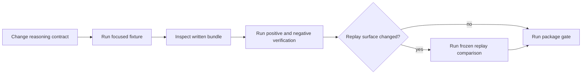

# Local Development

Develop reasoning changes against retained evidence, not only final text. A
useful local loop proves how a specification became a plan, which events
occurred, which exact bytes support each claim, why verification reached its
findings, and whether frozen replay preserves the governed record.



## Bootstrap from the repository root

```bash
make install
make -f makes/packages/bijux-canon-reason.mk \
  -C packages/bijux-canon-reason help
```

Use root dispatch for normal package checks:

```bash
make test PACKAGE=bijux-canon-reason
make lint PACKAGE=bijux-canon-reason
make quality PACKAGE=bijux-canon-reason
```

The profile provisions `packages/bijux-canon-reason/.venv` and keeps generated
evidence under `artifacts/`. The package directory has no standalone Makefile;
`make -C packages/bijux-canon-reason <target>` is therefore not a valid
command unless the repository profile is supplied with `-f`.

## Start with the nearest invariant

```bash
packages/bijux-canon-reason/.venv/bin/python -m pytest \
  packages/bijux-canon-reason/tests/<area>/<test-file>.py -q
```

| Changed behavior | Evidence to inspect |
| --- | --- |
| `ProblemSpec` or plan | canonical identity, node dependencies, refusal, and plan serialization |
| runtime or tool registry | descriptor fingerprint, call/return pairing, failure, and frozen substitute |
| evidence registration | retained bytes, safe path, content digest, span bounds, and chunk identity |
| claim construction | kind, status, confidence, content identity, and support edges |
| trace event | order, schema version, canonical JSONL, and trace fingerprint |
| verifier | passing check, deliberate failure, severity, stable identifier, and report summary |
| manifest or bundle | sorted inventory, file digests, missing-file behavior, and non-overwrite rules |
| replay | pinned corpus, frozen tool returns, invariant checksum, fingerprint diff, and refusal |

Always include a negative fixture for grounding or verification changes. A
passing bundle proves little if tampered evidence, an invalid span, or a missing
support target is accepted by the same path.

## Exercise the public boundary that moved

For CLI work, invoke `run`, `verify`, or `replay` against a disposable bundle
under `artifacts/` and inspect both JSON output and files. For HTTP or OpenAPI
changes:

```bash
make api PACKAGE=bijux-canon-reason
```

For root imports, package data, entry points, or distribution metadata:

```bash
make build PACKAGE=bijux-canon-reason
```

Use `make docs-check` when reader-visible artifact meaning or limitations
change. Verification terminology must stay precise: a passing structural and
grounding report is not proof of source authority or real-world truth.

## Preserve the full review unit

Keep the specification, plan, runtime descriptor, trace, evidence bytes,
claims, verification reports, run metadata, manifest, and replay comparison
together. A final claim or trace fingerprint by itself is not enough to debug a
semantic change.

See [change validation](../quality/change-validation.md) for risk routing and
[artifact contracts](../interfaces/artifact-contracts.md) for the files a
focused fixture must preserve.
