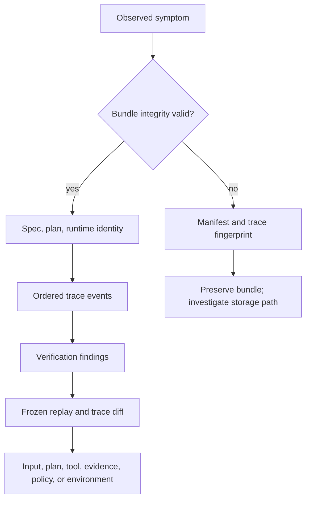

# Observability and Diagnostics

The primary telemetry of `bijux-canon-reason` is the run bundle. It records the
requested problem, chosen plan, ordered execution, exact evidence, verification
findings, runtime identity, and file digests. Logs can help locate a process
failure, but they cannot replace this evidence chain.



## Read the Bundle in Authority Order

Preserve the entire run directory before investigating. A normal bundle
contains:

| Artifact | Diagnostic question |
| --- | --- |
| `manifest.json` | do the retained files match the digests written with the run? |
| `fingerprint.txt` | do the exact canonical `trace.jsonl` bytes still match? |
| `run_meta.json` | which run, preset, seed, runtime, tools, schemas, and producer created this result? |
| `spec.json` | what problem and constraints were actually requested? |
| `plan.json` | which content-addressed DAG was executed? |
| `trace.jsonl` | what happened, in what order, and with which linked objects? |
| `verify.json` | which invariants passed, warned, or failed during the run? |
| `replay/trace.jsonl` | did frozen execution reproduce the canonical trace? |

Start with manifest and fingerprint validation when alteration, truncation, or
partial copying is possible. Integrity failure is a storage or transfer
incident; do not interpret the contents as a reasoning disagreement until the
bundle is known to be intact.

`manifest.json` covers the initial bundle and does not list itself. Files
created later, including `verify.verify.json` and `replay/trace.jsonl`, are not
retroactively added. Validate those derived files according to the command
that produced them.

## Follow the Trace

The canonical JSONL trace begins with its identity and metadata, followed by
typed events. Read events in index order and maintain these links:

```mermaid
flowchart LR
    start[step_started] --> call[tool_called]
    call --> returned[tool_returned]
    returned --> evidence[evidence_registered]
    evidence --> claim[claim_emitted]
    claim --> finish[step_finished]
    evidence -. exact span and hash .-> source[Source bytes]
```

A step does not need every event type, but every recorded call and result must
pair correctly, step boundaries must balance, evidence identifiers must be
unique, and claims must point to registered evidence. A `SupportRef` identifies
an exact, non-empty byte span and SHA-256 digest; checking only a URI or document
name is insufficient.

Useful trace pivots are:

- `spec_id` and `plan_id` for input and planning drift;
- step ID and event index for ordering or incomplete execution;
- call and result IDs for provider failures or substitutions;
- evidence and claim IDs for broken support linkage;
- runtime descriptor and configuration fingerprint for environment drift;
- trace fingerprint for byte-for-byte replay comparison.

## Interpret Verification Precisely

Read individual invariant IDs, severities, and failures before summary counts.
The summary exposes checks and failures; it is not a latency dashboard or a
quality score. A command can write a useful verification report without making
the run acceptable under the caller's policy.

Standalone `verify` writes `verify.verify.json` beside the trace and preserves
the original `verify.json`. Compare both reports when the package, invariant
set, or policy has changed. A newly reported finding may be verifier drift
rather than execution drift; retain the producer and invariant checksums needed
to distinguish them.

## Diagnose by Symptom

| Symptom | Evidence path | Likely boundary |
| --- | --- | --- |
| result differs with the same request | spec ID → plan ID → runtime descriptor → trace diff | planning, runtime, provider, or environment |
| missing or weak citation | claim → support ID → evidence event → exact source span | retrieval, evidence selection, or claim construction |
| unmatched tool activity | step events → call ID → result ID | runtime or interrupted execution |
| verification failure | invariant ID → affected event or object → producer metadata | execution contract, evidence linkage, or verifier version |
| replay fingerprint mismatch | original trace → replay trace → first differing event | runtime descriptor, frozen result, event order, or canonicalization |
| unexpected disk growth | manifest paths plus later derived files | corpus pinning, index, tool result, evidence, or replay |
| HTTP request succeeds but run is unusable | response metadata → retained bundle → `verify.json` | caller policy or incomplete acceptance check |

Find the earliest authoritative divergence. Differences in final prose are
downstream symptoms; the first differing plan node, tool result, evidence span,
or claim link is usually more actionable.

## Replay as a Diagnostic

Replay loads `spec.json`, `plan.json`, and `run_meta.json`, executes against
recorded tool results, writes a separate trace, and compares canonical
fingerprints. It does not call live providers and does not validate the whole
manifest.

- Matching fingerprints show that frozen execution reproduced the trace under
  the replay contract.
- A mismatch identifies deterministic-execution, serialization, runtime, or
  recorded-result drift.
- A match does not prove that the original source, provider, or claim was
  scientifically correct; use evidence inspection and verification for that.

When replay differs, compare the first changed event rather than only the final
fingerprint. Then follow its step, tool, evidence, or claim identifiers back to
the plan and runtime descriptor.

## Minimum Incident Record

Retain the following together:

- the complete run directory, including pinned provenance and indexes;
- command and package version, deployment identity, and relevant resource
  limits;
- request ID or service correlation ID, if the run entered through HTTP;
- the original and standalone verification reports;
- replay output and the generated replay trace;
- provider or transport logs needed to explain a failed call.

Do not paste secrets, authorization headers, or unrestricted source corpora
into tickets. Preserve sensitive bundles in an access-controlled artifact
store and share stable identifiers, hashes, and the smallest redacted excerpt
that still demonstrates the problem.

See [Failure Recovery](failure-recovery.md) for retry and preservation rules,
[Operator Workflows](../interfaces/operator-workflows.md) for verification and
replay commands, and [Artifact Contracts](../interfaces/artifact-contracts.md)
for the byte-level integrity model.
