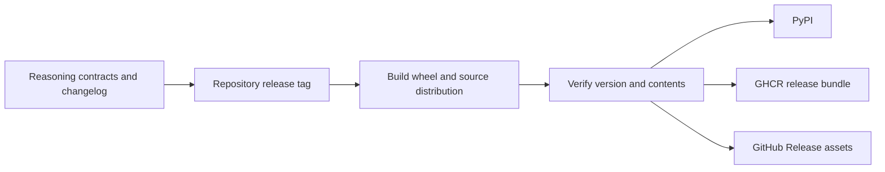

# Release and Versioning

`bijux-canon-reason` derives its distribution version from the repository-wide
`v<version>` tag. A reasoning release binds model contracts, canonicalization,
bundle files, verification policy, CLI and HTTP behavior, and replay semantics
to one tagged source state.



## What constitutes a reasoning release change

| Changed surface | Release significance |
| --- | --- |
| `ProblemSpec`, plan, claim, trace, support, or report model | public data-contract change |
| canonical JSON, JSONL, fingerprint, or checksum inputs | identity and replay change |
| evidence path, span, digest, or manifest behavior | bundle-integrity change |
| verifier check, severity, or policy | acceptance interpretation change |
| CLI option, exit status, or artifact layout | automation and custody change |
| HTTP route or envelope | service contract change |
| runtime or retrieval default | reproducibility and external-dependency change |

Describe the caller-visible consequence in
`packages/bijux-canon-reason/CHANGELOG.md`. State whether existing bundles can
still be verified and replayed, whether a migration is available, and which
identity-bearing files will differ.

## Version and artifact guards

Hatch VCS resolves the package version from Git. Untagged or dirty source may
produce development or local version markers; publication rejects those unless
the workflow explicitly permits them. The publication guard also checks that
wheel and source distribution filenames match the resolved version.

Changing a fallback string is not a release. Tag, metadata, changelog, installed
version, and built artifact names must identify the same release.

## Focused release evidence

```bash
make test PACKAGE=bijux-canon-reason
make lint PACKAGE=bijux-canon-reason
make quality PACKAGE=bijux-canon-reason
make api PACKAGE=bijux-canon-reason
make build PACKAGE=bijux-canon-reason
```

Inspect the built distributions for the complete package, `py.typed`, CLI entry
points, license, README, and any package data required by the API or artifact
contracts. Install the wheel in an isolated environment and prove that `run`,
`verify`, and `replay` agree on one retained bundle.

## Compatibility and publication

The package also installs the `bijux-rar` command as a compatibility entry
point. New command and artifact meaning begins in `bijux-canon-reason`; the
alias must not create a separate verifier or replay policy.

The same staged distributions feed PyPI, GHCR release bundles, and GitHub
Release assets. Publication to several custody surfaces does not multiply the
implementation or strengthen its truth claims.

A release is incomplete if an existing bundle changes meaning without a
versioned contract, explicit incompatibility, and reader-visible migration or
retention guidance.
