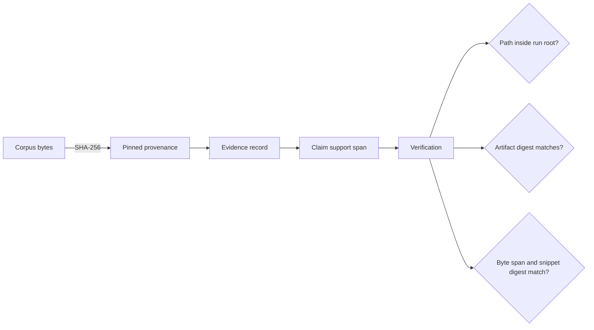

# Security and Safety

Treat specifications, corpora, traces, and evidence files as untrusted input.
The package can read a configured corpus and write an auditable run tree, but it
does not provide a sandbox, scientific peer review, or a production identity
system.

## Evidence integrity boundary

Evidence verification resolves each recorded content path beneath the supplied
artifact root and rejects paths that escape it. It then checks the evidence
file digest, the exact byte range used by a support, and that range's SHA-256
digest. The run manifest covers the core run files and discovered provenance
files.

These checks establish traceability and tamper evidence. They do not establish
source reliability, causal validity, or the truth of a generated conclusion.
Those remain review responsibilities for the domain using the package.

## Operating controls

- Place the artifact root on a filesystem with permissions appropriate for the
  specifications, corpus snapshots, and evidence it contains.
- Pin corpus inputs. A mutable path can resolve to different bytes on a later
  run even when its filename is unchanged.
- Set `RAR_RETRIEVAL_CORPUS_MAX_BYTES` before loading externally supplied
  corpora. Set disk, elapsed-time, and CPU budgets for shared environments.
- Do not treat the elapsed-time or CPU settings as kill switches: the current
  implementation checks them after execution returns.
- Keep run manifests and fingerprints with exported artifacts. Verification
  without the artifact directory skips file-backed evidence checks.
- Avoid placing credentials or private tokens in specifications, corpus text,
  tool results, or metadata because those values can become durable artifacts.

## HTTP deployment boundary

The API rejects declared request bodies larger than 8 KiB, XML media types,
item responses larger than 2 MiB, offsets above 1,000,000, and list responses
above 100 items. The request-size guard depends on `Content-Length`; deploy a
reverse proxy or ASGI server with an independently enforced body limit when
clients are not trusted.

Authentication is optional. When `RAR_API_TOKEN` is unset, the application
accepts requests without credentials. When it is set, clients must send the
exact value in `x-api-token`. This shared-token mechanism does not provide
users, roles, tenant isolation, token rotation, or transport encryption.

`RAR_API_RATE_LIMIT` enables an in-process counter keyed by the supplied token
or by the anonymous bucket. The default is disabled, and state is neither
distributed nor durable. Put externally reachable deployments behind TLS,
strong identity and authorization, network-level request limits, and durable
observability.

## Safe interpretation

A clean verification report means the trace satisfied the implemented
structural and provenance invariants under the chosen policy. Always retain the
policy, specification, runtime descriptor, and source evidence when a decision
depends on that result.
