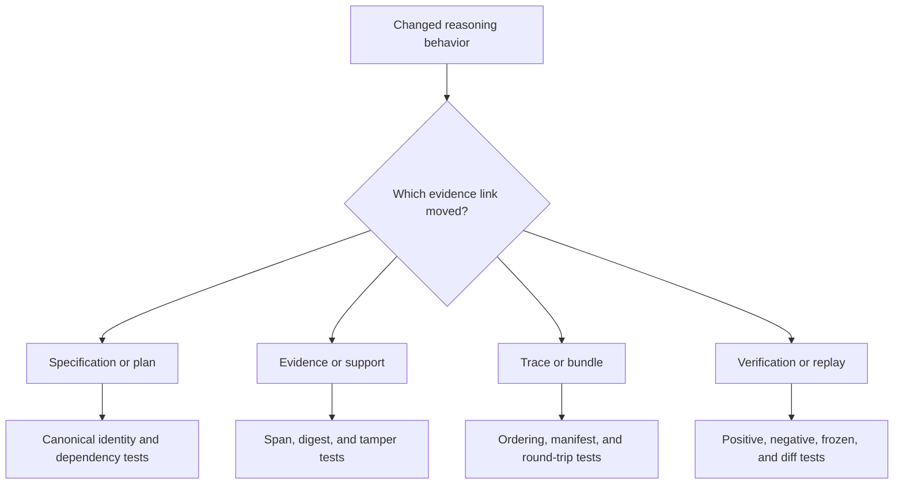

# Change Validation

Validate reasoning changes against the evidence chain, not answer plausibility.
A convincing sentence can still come from the wrong bytes, an invalid support
edge, an incomplete trace, or a replay that quietly consulted live state.



## Risk-to-evidence matrix

| Risk | Required focused evidence |
| --- | --- |
| specification meaning changes without identity change | canonical-form and content-ID canary |
| plan order becomes ambiguous | dependency, cycle, stable-order, and serialization tests |
| evidence is cited by label only | retained bytes, exact span, snippet digest, and target-ID assertions |
| support survives source tampering | changed-byte and out-of-range-span rejection tests |
| claim status implies unsupported truth | independent kind, status, confidence, and support fixtures |
| trace omits causal events | start/finish, call/return, evidence, claim, failure, and order assertions |
| verifier accepts malformed bundles | missing, duplicate, digest-mismatch, unsafe-path, and schema tests |
| standalone verify overwrites run evidence | original-report preservation and distinct output-path test |
| replay invokes live state | frozen-tool and pinned-retrieval tests with live access disabled |
| replay equality ignores semantic change | checksum, fingerprint, policy, corpus, and structured-diff tests |

## Select the narrowest useful command

```bash
packages/bijux-canon-reason/.venv/bin/python -m pytest \
  packages/bijux-canon-reason/tests/<area>/<test-file>.py -q

make test PACKAGE=bijux-canon-reason
```

Add only the boundary lanes implicated by the change:

```bash
make api PACKAGE=bijux-canon-reason
make lint PACKAGE=bijux-canon-reason
make quality PACKAGE=bijux-canon-reason
make build PACKAGE=bijux-canon-reason
make docs-check
```

## Validate claims by failure as well as success

Every new verifier or support rule needs a fixture that passes and a fixture
that fails for the intended invariant. Assert the stable finding identifier,
severity, target, and retained details—not only the report's aggregate Boolean.

For replay, disconnect live tools and make recorded inputs the only available
path. A new live run with the same answer is not replay evidence. For manifest
work, verify the file digests directly because trace equality and whole-bundle
integrity cover different surfaces.

Update artifact, limitation, and release documentation when any retained file,
identity input, verification meaning, or replay precondition changes.

Validation is sufficient when a reviewer can tamper with the relevant link,
observe an exact governed failure, and reproduce the positive result from the
retained bundle alone.
