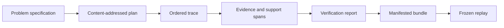

# Evidence Release Acceptance

A reasoning change is releasable when its claims, support, trace, verification,
bundle, and replay record constrain one another. Fluent output, a passing
process, or a stable fingerprint cannot substitute for that chain.

## Acceptance record

| Changed surface | Required evidence | Release-blocking result |
| --- | --- | --- |
| model, identifier, or canonicalization | validation, stable-ID, cross-platform serialization, and changed-content comparison | different content reuses an identity |
| plan topology | deterministic DAG fixtures, cycle and missing-dependency refusal | an invalid graph reaches execution |
| tool or lifecycle event | call/return linkage, event order, failure, and unfinished-step cases | an orphan or incomplete action is finalized |
| evidence registration | governed path, retained bytes, content digest, span bounds, and chunk identity | support resolves outside the bundle or against changed bytes |
| claim construction | support edges, status, confidence, type, and insufficiency cases | a derived unsupported claim is finalized |
| verifier | one positive and targeted negative case for every affected check | corruption passes or fails only through an unrelated parse error |
| manifested run | core-file inventory, digests, runtime identity, checksum, and incomplete bundle refusal | individually plausible files describe different runs |
| replay | original checksum, frozen tool results, pinned retrieval artifacts, fingerprint, and structured diff | replay consults live retrieval or accepts provenance drift |
| behavioral claim | named corpus, cases, constraints, insufficiency policy, and metric artifacts | artifact validity is presented as scientific usefulness |

## Claim disposition must remain explicit

Kind, support, verification, and status are independent dimensions. A release
must preserve their combination rather than reducing it to confidence:

| Claim condition | Acceptable disposition | Release-blocking distortion |
| --- | --- | --- |
| observed claim with exact retained bytes | proposed or validated according to applicable checks | describing observation as independently verified truth |
| assumed claim declared by the problem or policy | proposed with assumption identity visible | presenting the assumption as retrieved evidence |
| derived claim with a complete support path | proposed, validated, or rejected with findings | removing intermediate support or retaining only final prose |
| support span or digest mismatch | rejected or explicit verification failure | keeping validated status because the surrounding sentence is similar |
| applicable check cannot run | insufficient evidence or non-passing verification result | silently omitting the check from the report |
| relevant evidence is absent | `insufficient_evidence` where policy permits refusal | inventing support through confidence, provider reputation, or prior output |

A rejected claim can be evidence that the verification boundary worked. An
`insufficient_evidence` result can be a correct reasoning outcome. Acceptance
concerns whether the record represents those decisions honestly, not whether
every case ends with a positive conclusion.

## Bundle acceptance procedure

Review a release fixture as a closed evidence object:

1. recompute the specification, plan, claim, evidence, and trace identities
   from canonical content;
2. validate plan topology and match every execution event to an authorized
   node, call, or return;
3. resolve every `SupportRef` against the retained evidence bytes and recompute
   its snippet digest;
4. confirm the verification report contains every applicable check and the
   intended positive or negative result;
5. recompute the manifest inventory and invariant checksum over the exact run
   files; and
6. replay from recorded results only, then retain the structured comparison.

The planning, execution, retrieval, reasoning, trace, verification, CLI, API,
and replay suites protect different links in this procedure. A release claim
must name the links it exercised. Passing serialization tests alone does not
establish support integrity, and a replay fingerprint alone does not establish
claim validity.

## Custody and interpretation

Retain the specification, plan, runtime descriptor, trace, evidence bytes,
claims, verification reports, run metadata, manifest, and replay output as one
review unit. A trace fingerprint establishes identity of the trace file; it
does not establish source authority, entailment, completeness, or truth.

An `insufficient_evidence` result is acceptable when the case and policy allow
refusal. Hiding that refusal behind an empty or confident answer is not.

Use [change validation](change-validation.md) to route focused evidence and
[known limitations](known-limitations.md) to bound the resulting release claim.
