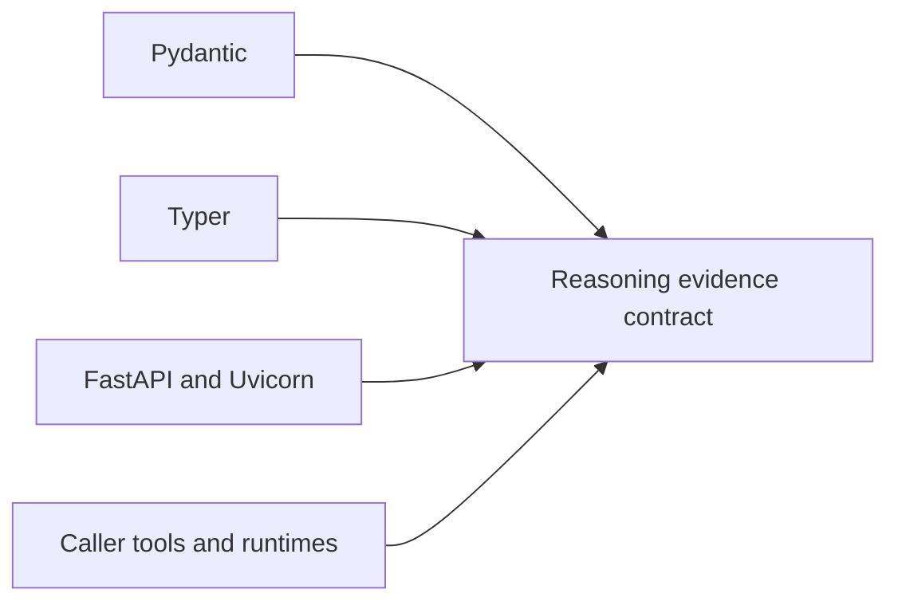

# Reasoning Dependency Authority

The core package deliberately avoids an external LLM dependency. Its declared
dependencies own validation and interface behavior; caller-supplied runtimes,
tools, retrievers, and providers join the evidence boundary only when their
identity and outputs are retained.

## Dependency classes

| Boundary | Authority introduced | Evidence required when it changes |
| --- | --- | --- |
| Pydantic | model validation, strict fields, serialization, and content identity inputs | invalid model matrix, canonical snapshots, and fingerprint comparison |
| Typer | command parsing, defaults, exit behavior, and JSON selection | command matrix, help surface, success and refusal exits |
| FastAPI and Uvicorn | HTTP validation, error translation, access guards, and schema | OpenAPI drift, endpoint matrix, size/path guards, and security regression |
| Schemathesis in the API extra | generated HTTP contract exploration | retained seed, schema identity, failures, and server log |
| caller runtime or tool | execution behavior, external effects, timing, and returned evidence | descriptor fingerprint, call/return records, failures, and frozen substitutes |
| external retriever or provider | corpus selection, ranking, availability, and mutable remote state | source and model identity, parameters, returned bytes, and provenance |

## Admission rules

- A validation upgrade must not reuse stable identifiers for differently
  interpreted content.
- A CLI or HTTP upgrade must preserve typed failure and refusal behavior.
- External tools do not receive implicit deterministic status from a stable
  name; their descriptor and observed results define the run boundary.
- Frozen replay never calls a provider to “confirm” a previous result. A fresh
  provider call is a new execution with new evidence.
- An LLM integration belongs behind an explicit runtime/tool contract rather
  than becoming an undeclared core dependency.

Dependency resolution and audit reports establish installed versions and known
advisories. They cannot establish that an external source is correct or that a
provider behaves consistently behind a stable identifier.

## Prove semantic compatibility

Run dependency changes against a frozen evidence bundle and a deliberately
invalid bundle. Preserve the prior and proposed environments, canonical input
identities, resulting claim/support graph, checks, findings, manifest, trace,
public serialization, and failure envelopes.

| Changed authority | Comparison that matters | Blocking difference |
| --- | --- | --- |
| Pydantic | model admission, extra fields, defaults, enum/status meaning, canonical bytes and stable hashes | the same bytes acquire different semantic identity without a contract change |
| Typer | option/default resolution, path handling, JSON output, stdout/stderr separation and exit status | a refusal becomes success, machine output becomes ambiguous, or evidence paths resolve differently |
| FastAPI/Uvicorn | schema plus live status/body/headers, authentication, limits and exception translation | schema-only parity, leaked exception detail, widened input, or changed typed error |
| verification/check implementation | observed inputs, findings, severity, applicability, unavailable-check behavior and policy disposition | missing or failed checks are silently treated as passing |
| caller tool/runtime | descriptor, input/output bytes, effect/failure record, timing policy and frozen substitute | tool identity is stable while behavior-bearing inputs or outputs are not retained |
| retriever/provider | corpus/model/service identity, request parameters, returned bytes/ranks and provenance | mutable remote output is used to rewrite frozen replay evidence |

Hash differences are expected when meaning-bearing evidence changes. The
review question is whether the new identity is propagated through every claim,
support, finding, manifest and replay comparison—not whether snapshots can be
made green.

## Manifest external authority

For every caller-supplied runtime, tool, retriever, or provider, retain a
descriptor with implementation and service identity, configuration, model or
corpus identity, allowed effects, timeout/retry policy, determinism statement,
redaction policy, and stable failure classes. Join each call and result to that
descriptor in the trace. If the implementation cannot disclose a precise
version, record that limitation and narrow replay and reproducibility claims.

An external dependency must never gain claim-verification authority merely by
returning a confident answer. Its output enters as evidence or an observation;
the reason-owned support and verification contracts decide how it may be used.

Use [test strategy](test-strategy.md) for interface, tamper, and replay evidence
and [risk register](risk-register.md) for the residual provider and source
boundary.
