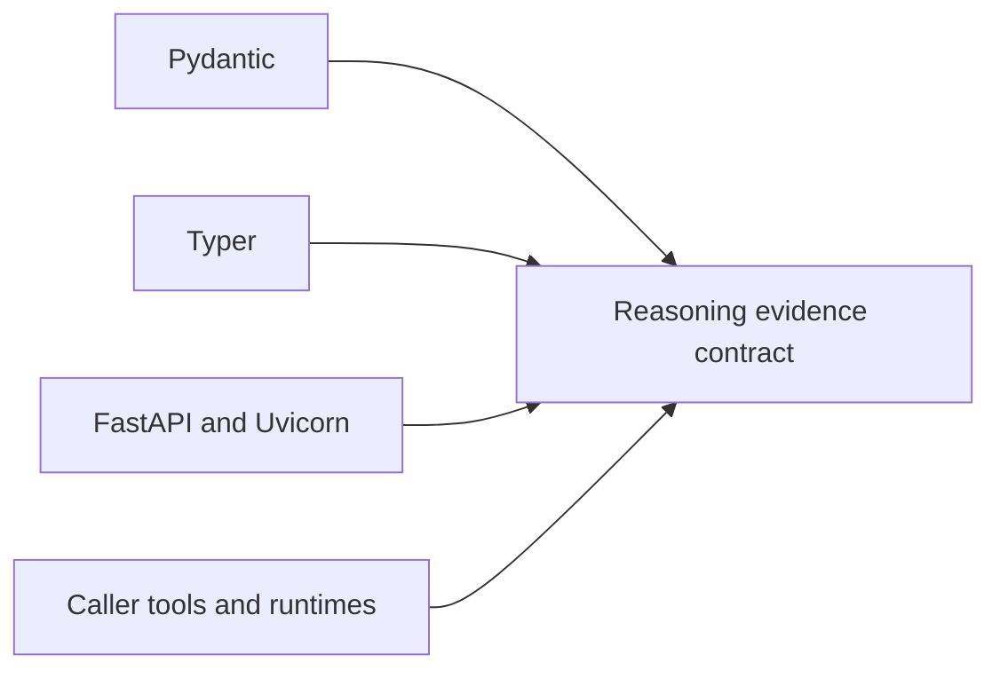

# Reasoning Dependency Authority

The core package deliberately avoids an external LLM dependency. Its declared
dependencies own validation and interface behavior; caller-supplied runtimes,
tools, retrievers, and providers join the evidence boundary only when their
identity and outputs are retained.

## Dependency classes

| Boundary | Authority introduced | Evidence required when it changes |
| --- | --- | --- |
| Pydantic | model validation, strict fields, serialization, and content identity inputs | invalid model matrix, canonical snapshots, and fingerprint comparison |
| Typer | command parsing, defaults, exit behavior, and JSON selection | command matrix, help surface, success and refusal exits |
| FastAPI and Uvicorn | HTTP validation, error translation, access guards, and schema | OpenAPI drift, endpoint matrix, size/path guards, and security regression |
| Schemathesis in the API extra | generated HTTP contract exploration | retained seed, schema identity, failures, and server log |
| caller runtime or tool | execution behavior, external effects, timing, and returned evidence | descriptor fingerprint, call/return records, failures, and frozen substitutes |
| external retriever or provider | corpus selection, ranking, availability, and mutable remote state | source and model identity, parameters, returned bytes, and provenance |

## Admission rules

- A validation upgrade must not reuse stable identifiers for differently
  interpreted content.
- A CLI or HTTP upgrade must preserve typed failure and refusal behavior.
- External tools do not receive implicit deterministic status from a stable
  name; their descriptor and observed results define the run boundary.
- Frozen replay never calls a provider to “confirm” a previous result. A fresh
  provider call is a new execution with new evidence.
- An LLM integration belongs behind an explicit runtime/tool contract rather
  than becoming an undeclared core dependency.

Dependency resolution and audit reports establish installed versions and known
advisories. They cannot establish that an external source is correct or that a
provider behaves consistently behind a stable identifier.

Use [test strategy](test-strategy.md) for interface, tamper, and replay evidence
and [risk register](risk-register.md) for the residual provider and source
boundary.
