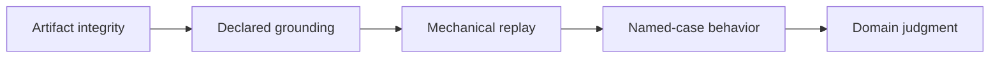

# Public Claim Standards

Reasoning claims distinguish structural integrity, grounding, reproducibility,
and scientific validity. Evidence for one category cannot be silently promoted
into another.

## Claim vocabulary

| Public wording | Evidence required | Bound on the claim |
| --- | --- | --- |
| structurally valid trace | supported header, ordered events, complete lifecycle, and linked tool calls | says nothing about source truth |
| grounded claim | exact retained span, snippet digest, evidence identity, and support edge | does not establish source authority or entailment by itself |
| verified bundle | complete registered checks and a report with no policy-blocking failure | covers declared checks, not every possible defect |
| reproducible run | specification, preset, seed, runtime fingerprint, canonical files, and matching replay | applies to frozen recorded inputs and results |
| replayed successfully | invariant checksum and trace comparison pass using retained artifacts | is not a fresh call to external sources or providers |
| behavior supported by evaluation | named corpus, cases, constraints, expected refusals, and metric artifacts | does not generalize beyond represented cases |
| confident claim | explicit confidence field and support record | is not automatically calibrated probability |

## Evidence citations

A citation names the governed source identity and exact persisted bytes. Human
readers can resolve the span, compare its digest, and inspect the derivation.
Nearby text, a source label without a span, or a hash without retained bytes is
not described as direct support.

## Honest refusals

Insufficient evidence, unsupported capability, provenance drift, and failed
verification remain visible outcomes. Public examples do not rewrite them as
successful answers. The local extractive reasoner and BM25 retrieval path are
described as deterministic reference implementations rather than general
reasoning or state-of-the-art retrieval.

See [invariants](invariants.md) for machine-enforced laws and
[risk register](risk-register.md) for epistemic and custody risks that remain.
