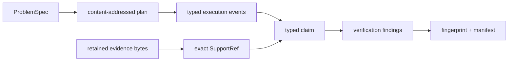

# Interpreting Reasoning Evidence

Review a reasoning result as a chain of custody from problem and plan to exact
evidence, inference, verification, and manifested run. Final prose is a
projection of that chain, not a substitute for it.

## Follow One Claim

| Review question | Evidence to inspect | What remains unproven |
| --- | --- | --- |
| What was the system asked to establish? | `ProblemSpec`, constraints, expected output, stable identity | whether the problem formulation is complete |
| Why did this reasoning action occur? | plan node, dependencies, ordered trace event | whether the plan is sufficient for the domain |
| Which source content was available? | `EvidenceRef`, retained bytes, source identity and digest | source authority, freshness, and completeness |
| Which bytes support the statement? | `SupportRef` span, snippet digest, support kind | that the inference from those bytes is valid |
| What kind of statement is it? | observed, assumed, or derived claim kind and status | whether confidence is calibrated |
| Which checks evaluated it? | complete verification findings and policy disposition | defects outside the registered checks |
| Is the run internally complete? | plan, trace, verification report, fingerprint, metadata, manifest | real-world truth or generalization |
| What did replay establish? | frozen inputs, invariant checksum, trace comparison and diff | current external source or provider behavior |

## Bounded Reasoning Vocabulary

| Claim | Required evidence | Bound on the claim |
| --- | --- | --- |
| structurally valid trace | supported header, ordered events, complete lifecycle, linked calls and returns | says nothing about source truth |
| grounded claim | retained span, snippet digest, evidence identity, and support edge | does not establish source authority or entailment by itself |
| verified run | complete registered checks and explicit policy disposition | covers declared checks, not every possible defect |
| reproducible run | specification, preset, seed, runtime fingerprint, canonical files, and matching replay | applies to frozen recorded inputs and results |
| successful replay | invariant checksum and trace comparison pass over retained artifacts | is not a fresh call to tools or sources |
| evaluated behavior | named corpus, cases, constraints, expected refusals, definitions, and metrics | does not generalize beyond represented cases |
| confident claim | explicit confidence field linked to the claim and support | is not automatically a calibrated probability |

## Distinguish Linkage, Grounding, And Truth

A content digest proves identity. A support reference proves that a claim is
linked to exact bytes under the recorded support kind. A verification report
proves that registered checks reached their recorded findings. None alone
proves that the source is correct, that contrary evidence is absent, or that a
domain expert should act on the conclusion.

`insufficient_evidence`, unsupported capability, provenance drift, rejected
claims, and verification failures are evidence-bearing outcomes. Do not remove
them when projecting a run into a summary. The local extractive reasoner and
BM25 path are inspectable references, not claims of general reasoning ability
or state-of-the-art retrieval.

## Preserve The Review Bundle

Retain the specification, plan, runtime descriptor, evidence bytes and source
metadata, claims, support references, tool calls and results, typed trace,
verification report, fingerprint, run metadata, and manifest. A citation label
without the bytes, a hash without a retrievable object, or prose without claim
identity breaks later review even if the output still looks plausible.

Continue with [invariants](invariants.md) for enforced reasoning laws,
[known limitations](known-limitations.md) for epistemic and operational bounds,
and the [risk register](risk-register.md) for custody and interpretation risks.
