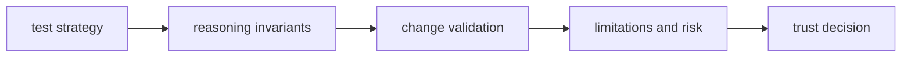

# Quality

Open this section when you need to decide whether claims, checks, and reasoning artifacts are proven strongly enough for reviewers and downstream packages to trust.

## Trust Model

Reason quality has to justify interpretation, not only execution. A reviewer
should be able to see how claim behavior is tested, what must not drift in the
checks and artifacts, and where the package still names limits instead of
pretending that explanation alone is proof.

## Read These First

- open [Test Strategy](https://bijux.io/bijux-canon/04-bijux-canon-reason/quality/test-strategy/) first when you need the broad proof shape behind reasoning behavior
- open [Invariants](https://bijux.io/bijux-canon/04-bijux-canon-reason/quality/invariants/) when the question is what must not drift across claim and verification behavior
- open [Change Validation](https://bijux.io/bijux-canon/04-bijux-canon-reason/quality/change-validation/) when you need the minimum proof for a safe reasoning change

## Trust Risk

The main quality risk here is looking explainable on paper while the actual reasoning proof path is too weak to defend under review.

## First Proof Check

- `tests` and package-local validation surfaces for executable evidence
- invariants, limitations, and risk pages for the trust boundaries that still matter after green checks
- release notes and caller-facing docs when the change alters what readers may safely assume

## Pages In This Section

- [Test Strategy](https://bijux.io/bijux-canon/04-bijux-canon-reason/quality/test-strategy/)
- [Invariants](https://bijux.io/bijux-canon/04-bijux-canon-reason/quality/invariants/)
- [Review Checklist](https://bijux.io/bijux-canon/04-bijux-canon-reason/quality/review-checklist/)
- [Documentation Standards](https://bijux.io/bijux-canon/04-bijux-canon-reason/quality/documentation-standards/)
- [Definition of Done](https://bijux.io/bijux-canon/04-bijux-canon-reason/quality/definition-of-done/)
- [Dependency Governance](https://bijux.io/bijux-canon/04-bijux-canon-reason/quality/dependency-governance/)
- [Change Validation](https://bijux.io/bijux-canon/04-bijux-canon-reason/quality/change-validation/)
- [Known Limitations](https://bijux.io/bijux-canon/04-bijux-canon-reason/quality/known-limitations/)
- [Risk Register](https://bijux.io/bijux-canon/04-bijux-canon-reason/quality/risk-register/)

## Leave This Section When

- leave for [Foundation](https://bijux.io/bijux-canon/04-bijux-canon-reason/foundation/) when the doubt is really about package ownership rather than proof
- leave for [Interfaces](https://bijux.io/bijux-canon/04-bijux-canon-reason/interfaces/) when the question is what the contract is rather than whether it is defended
- leave for [Operations](https://bijux.io/bijux-canon/04-bijux-canon-reason/operations/) when the package already seems trustworthy and the real issue is how to run it repeatably

## Design Pressure

If reasoning trust is reduced to formal checks without explaining what they
protect, the section becomes shallow again. Proof here has to connect behavior,
verification, and explicit limits.
