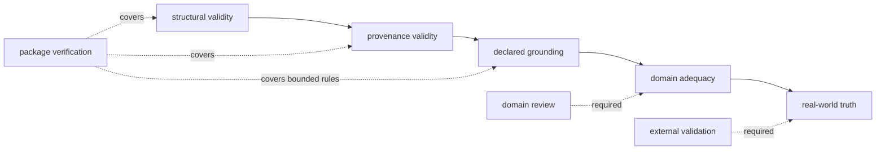

# Known Limitations

`bijux-canon-reason` verifies declared relationships among plans, tool events,
evidence bytes, claims, and artifacts. It does not verify reality. A trace can
be structurally impeccable and still rely on a false, stale, biased, or
irrelevant source.

## What Verification Means

| Verification layer | What a passing check establishes | What remains open |
| --- | --- | --- |
| structure | plan topology, event lifecycle, identifiers, and schemas satisfy implemented invariants | whether the selected plan is sufficient |
| provenance | recorded bytes, digests, paths, runtime identity, and manifests agree | whether the source was authorized, authoritative, or current |
| grounding | claims have the support relationships required by the selected policy | whether support is persuasive, complete, or correctly interpreted |
| domain adequacy | not established automatically | counterevidence, assumptions, calibration, and decision thresholds |
| truth | not established automatically | the state of the world and consequences of acting |

A support span proves byte linkage. A hash proves content identity. A confidence
field records a claim made by a producer. None of these is, by itself, a truth
test or a calibrated probability.

`insufficient_evidence` is a governed refusal to complete a claim under the
available evidence. It does not prove that no answer exists.

## Reference Reasoning And Retrieval

The bundled reasoner is extractive, and the local retrieval path uses BM25.
They provide an inspectable offline reference, not general-purpose reasoning or
state-of-the-art retrieval. Corpus composition, tokenization, chunk size,
overlap, BM25 parameters, and query wording all change which evidence becomes
available.

Corpus byte guards constrain reads but do not make the package a distributed
search service. Large, changing, remote, or multi-tenant corpora require an
index integration with explicit availability, freshness, authorization, and
provenance contracts.

## Replay Is Snapshot Replay

Replay reuses recorded tool results; it does not call live tools again. Equal
replay fingerprints establish that the recorded inputs and snapshots produce
the same governed trace under the supported canonicalization and runtime
protocol. They do not establish that a provider, URI, or corpus would return
the same information today.

Local evidence, corpus, index, and provenance artifacts are checked for drift
when available. A URI without archived bytes cannot be re-attested. If future
review depends on exact evidence, archive those bytes and their source metadata
with the run.

## Evaluation Metrics Are Bounded Proxies

Current evaluation summaries measure properties of produced traces:

- alignment rate is the share of emitted claims with at least one evidence
  support link;
- the reported faithfulness value is the mean support-link count among
  supported claims, not a semantic entailment score;
- `recall_at_k` and `mrr` currently indicate whether any evidence was
  registered, not relevance-judged information-retrieval recall or reciprocal
  rank;
- verification failure counts summarize implemented checks, not the complete
  error space.

Do not publish these values under conventional retrieval or faithfulness names
without their definitions. A domain evaluation must add relevance judgments,
expected claims or refusals, counterevidence cases, and consequences appropriate
to the intended use.

## Operational Guards

Artifact-workflow disk, wall-time, and CPU budgets are process-level checks,
not a scheduler, sandbox, hard deadline, or remote-resource limit. The
interface rate limiter is best-effort, in-memory, and process-local; it does not
coordinate workers or survive restart. API size guards do not provide
authentication, tenant isolation, malware screening, or network egress policy.

The evaluation command supports workflow and metrics artifacts, but named
suite discovery is not yet a stable public catalogue. Callers must supply and
version the exact suite material rather than depend on an implied packaged
benchmark name.

See the [risk register](risk-register.md) for observable hazards and the
[test strategy](test-strategy.md) for the evidence behind the bounded package
claims.
