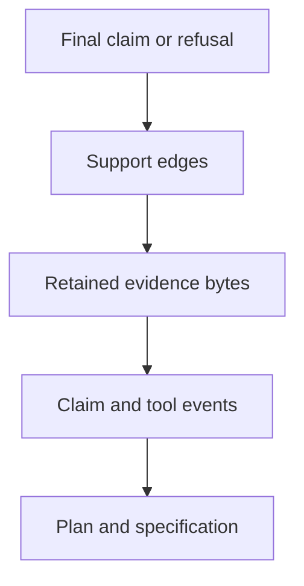

# Claim and Evidence Review

Review reconstructs the path from a problem specification to every finalized
claim. Begin with the claimed guarantee, then follow its identifiers and bytes
backward through the retained bundle.

## Structure and execution

- Are plan identifiers unique, dependencies present, and the graph acyclic?
- Do trace indices increase monotonically and every started step finish?
- Does every tool return reference one known call, with failure behavior
  retained rather than omitted?
- Are runtime descriptor, preset, seed, schema, and canonicalization identity
  present wherever reproducibility is claimed?

## Evidence and claims

- Does every support reference resolve to a governed path within the run root?
- Are byte spans valid and snippet hashes recomputed against retained content?
- Can a derived claim be traced through intermediate supports without a gap?
- Is insufficiency explicit when the available evidence cannot meet the
  requested constraint?

## Verification and bundle custody

- Does the report include every applicable registered check and its details?
- Do negative fixtures fail at the intended invariant rather than an earlier,
  unrelated parser?
- Do manifest digests, run metadata, trace checksum, and core files describe
  the same execution?
- Is an incomplete directory impossible to consume as a completed bundle?

## Replay and behavioral evidence

- Does replay use recorded tool results and pinned retrieval artifacts only?
- Are corpus, index, plan, or provenance changes rejected or exposed in the
  structured diff?
- Does an answer-quality claim identify the corpus, cases, constraints,
  expected refusal behavior, and metrics?
- Are truth, authority, freshness, and consequential fitness left to explicit
  source governance and domain review?

Conclude with [evidence release acceptance](definition-of-done.md) and compare
the claim with [known limitations](known-limitations.md).
