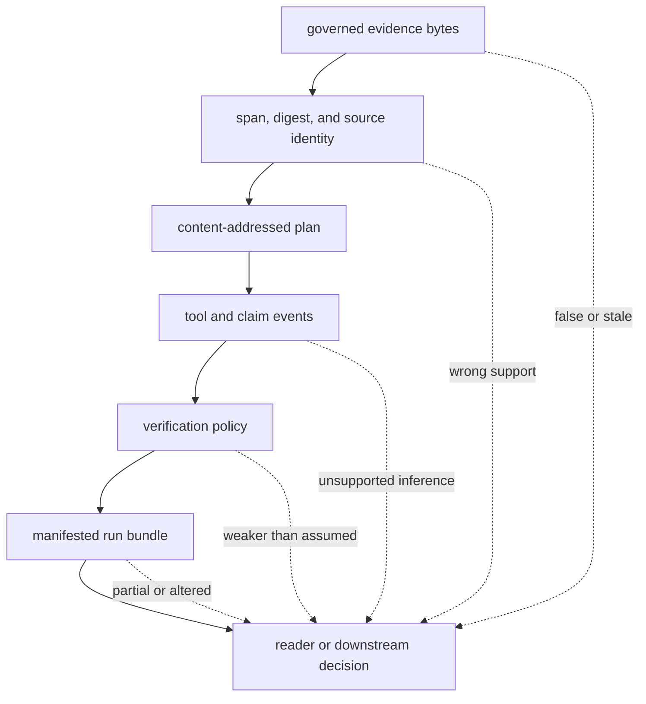
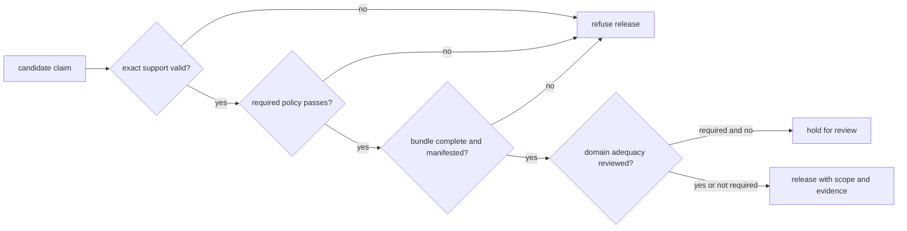

# Risk Register

The central risk in reasoning is epistemic overreach: stable artifacts and
fluent claims can make a bounded verification result appear stronger than it
is. Every accepted claim must preserve the route from exact evidence bytes,
through a governed plan and tool lifecycle, to the applicable verification
policy and complete run bundle.

## Claim Trust Path

## Persistent Risks

| Hazard | Severity | Detection signal | Required control | Residual owner |
| --- | --- | --- | --- | --- |
| citation names a source but does not bind exact support | critical | claim marker, evidence ID, span, snippet, and digest fail to reconcile | require byte-addressable evidence and verify the full support chain | reason workflow owner |
| correctly linked evidence is false, stale, or irrelevant | critical | independent source review conflicts with the archived evidence or its freshness requirement | record authority and observation time; require domain review and corroboration | source owner |
| derived claim outruns its supports | critical | claim contains material not entailed by extractive evidence or declared derivation | enforce support links and refusal; evaluate entailment and counterexamples externally | model or reasoner owner |
| omitted counterevidence produces a one-sided trace | critical | alternate retrieval or expert review surfaces material evidence absent from the plan | define corpus scope and counterevidence search; retain insufficiency as a valid outcome | decision owner |
| confidence is treated as calibrated probability | high | observed correctness by confidence bucket diverges from the stated value | label confidence semantics; calibrate against representative held-out data | evaluation owner |
| plan topology or tool lifecycle cannot justify the trace | high | cycles, missing tool returns, invalid ordering, or unbound evidence appear | enforce content-addressed DAG and event lifecycle invariants | executor owner |
| runtime or tool behavior changes behind stable-looking configuration | high | runtime, preset, provider, tool, or seed fingerprint differs | bind exact runtime descriptor and tool context to the trace | integration owner |
| permissive verification is summarized as an unqualified pass | critical | policy identity is absent or warnings disappear from the consumer view | retain policy and complete findings; require strict policy for strict claims | API consumer |
| artifact path escapes the governed run root | critical | normalized path resolves outside the root or manifest contains an unsafe target | normalize and contain paths; verify digest before access | deployment operator |
| run bundle is incomplete or concurrently interleaved | critical | manifest, trace, plan, report, and provenance IDs do not form one generation | isolate writers, stage the bundle, verify all core artifacts, then publish | artifact owner |
| snapshot replay is described as live reproduction | high | replay succeeds after live corpus or provider has changed | label snapshot replay; treat live revalidation as a new run | reviewer |
| proxy metrics are presented as semantic quality | high | metric label is reported without its implementation definition or relevance judgments | publish metric definitions and add domain-judged evaluation | evaluation owner |
| process-local rate or resource guard is treated as deployment isolation | high | multiple workers exceed aggregate policy or remote tools exceed local accounting | enforce quotas, sandboxing, and egress at the hosting boundary | service operator |

## Claim Release Gate

Release the verification report and evidence scope with the claim. Never reduce
a strict report to a Boolean that hides which checks applied, which findings
were filtered, or whether the conclusion is a refusal.

## Evidence Required By Change

- Evidence or claim changes require pass and tamper cases for IDs, spans,
  digests, citation markers, derivations, insufficiency, and unsupported claims.
- Planner, tool, or executor changes require topology, lifecycle, failure,
  deterministic identity, runtime drift, and replay scenarios.
- Verification-policy changes require strict, permissive, and audit comparisons
  with the complete findings retained.
- Artifact changes require missing-file, path-escape, checksum, concurrent-writer,
  incomplete-generation, schema, and manifest tests.
- Retrieval or evaluation changes require judged corpus evidence; structural
  trace metrics alone are insufficient to support a quality claim.

Verification narrows what can go wrong inside the declared model. Source
authority, freshness, domain interpretation, provider governance, privacy, and
the threshold for acting remain outside that model and must be explicit in the
deployment decision.

See [known limitations](known-limitations.md) for unsupported claims and
[architecture risks](../architecture/architecture-risks.md) for failure
mechanisms.
