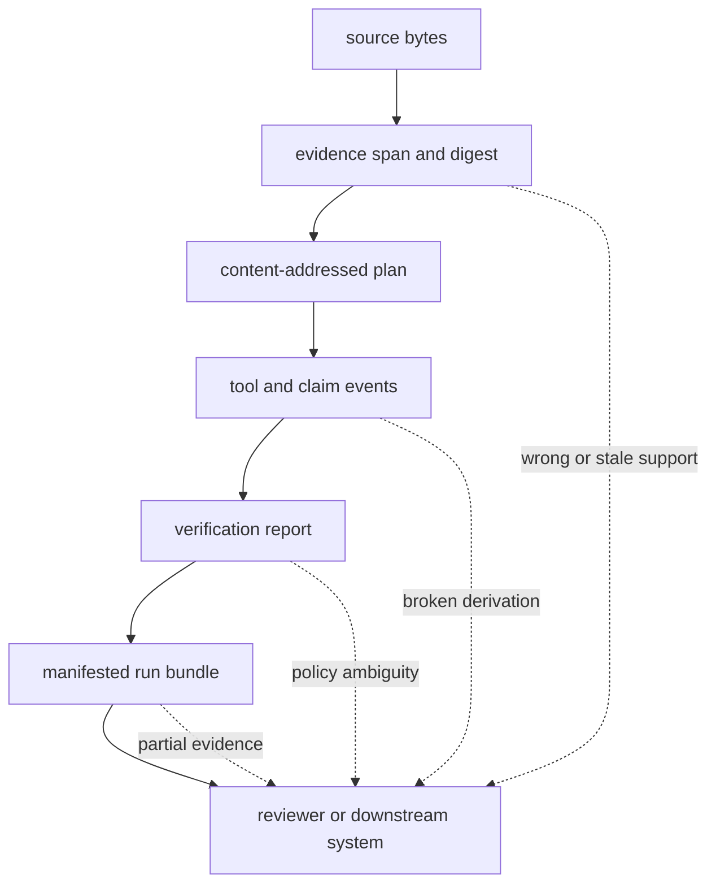
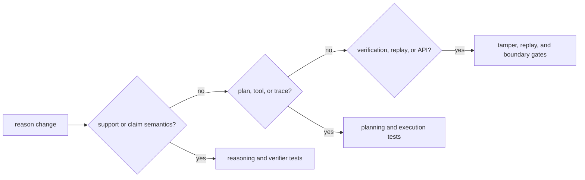

# Risk Register

Reason turns addressable evidence into structured claims and verification
records. Its primary hazard is epistemic overreach: a result can be stable,
well-formed, and fluent while its support is missing, altered, insufficient, or
checked under a weaker policy than the reader assumes.

## Risk Topology

## Active Risks And Controls

| Risk | Consequence | Preventive control | Detection evidence | Residual exposure |
| --- | --- | --- | --- | --- |
| citation label exists without exact support | a source name is mistaken for proof | retain byte span, snippet digest, and governed source identity | span-hash pass/tamper and verifier support tests | a correctly quoted source can still be false or irrelevant |
| unsupported derived claim is finalized | fluent synthesis outruns retrieved evidence | explicit support links, grounding invariants, and insufficiency outcome | executor claim-support, extractive reasoning, insufficiency, and negative-capability tests | domain adequacy still requires expert evaluation |
| plan topology or tool lifecycle is inconsistent | trace order cannot justify the final claim | content-addressed DAG and lifecycle enforcement | planner, IR, topology, missing-return, and cycle tests | external tools can behave incorrectly while satisfying shape |
| runtime or tool identity changes | equivalent-looking runs use different capabilities | fingerprint runtime descriptor, preset, seed, and tool context | fingerprint, determinism, trace metadata, and replay tests | external services may change behind stable configuration |
| permissive verification hides warnings | a pass summary implies a stronger policy | retain policy identity and complete applicable findings | verifier policy and failure-path tests | downstream systems can discard the detailed report |
| source or artifact path escapes its governed root | verification reads unintended evidence or exposes files | path guards, digest checks, and access controls | evidence path safety, API access, and security regression tests | host permissions remain a deployment responsibility |
| run directory is only partially finalized | a trace is consumed without manifest, plan, or provenance | require core artifact set and valid manifest | artifact builder, CLI evidence contract, and tamper matrix | directory writes are not one filesystem transaction |
| equivalent writers target the same stable run ID | concurrent output interleaves or overwrites | isolate artifact roots or serialize writers | deterministic IDs and artifact validation | coordination across processes is external |
| frozen replay is described as live reproduction | changed providers or corpora go undetected | label snapshot-only replay and refuse provenance drift | replay runtime, snapshot-only, changed-corpus, and replay-gate tests | live revalidation is a new execution, not replay |
| local BM25 grows into general index governance | retrieval authority is duplicated across packages | keep local retrieval bounded to reasoning evidence | retrieval limit, provenance, and package-boundary review | convenience can encourage unsupported backend expansion |

## Evidence Routing

A corpus or retrieval change also needs evaluation evidence because support
selection can change while every artifact invariant remains valid. Conversely,
an artifact-format change needs tamper and replay evidence even when answer
quality is identical.

## Operational Interpretation

Package verification establishes implemented structural and grounding
invariants. It does not establish truth. Deployment owners retain
responsibility for source authorization, retention, freshness, domain review,
external provider governance, and the decision threshold for acting on a
claim.

Use [architecture risks](../architecture/architecture-risks.md) for failure
mechanisms, [test strategy](test-strategy.md) for executable evidence, and
[known limitations](known-limitations.md) for the boundary of supported claims.
