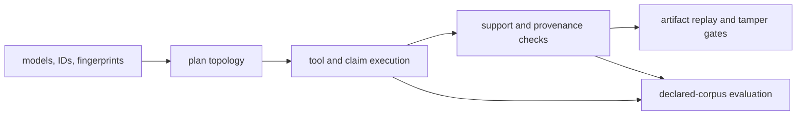

# Test Strategy

Reason tests defend two independent properties: artifact integrity and
reasoning behavior. Integrity tests ask whether plans, traces, evidence, and
replays are internally trustworthy. Evaluation tests ask how the reference
workflow behaves on a declared corpus and case set.

## Evidence Layers

Replay confidence and evaluation quality meet only at the retained artifact.
A reproducible unsupported answer remains unsupported; a useful answer without
an inspectable evidence chain remains unaudited.

| Test family | Principal claim |
| --- | --- |
| `tests/unit/core/` | stable identifiers, canonical fingerprints, supported versions, models, validators, and cross-platform serialization remain consistent |
| `tests/unit/planning/` | plans are deterministic, content-addressed DAGs with required topology |
| `tests/unit/execution/` | tool dispatch, fail-fast behavior, claim supports, runtime modes, and frozen replay preserve trace contracts |
| `tests/unit/retrieval/` | corpus loading, byte limits, chunk spans, BM25 ordering, index reuse, and rebuild-on-drift are deterministic |
| `tests/unit/reasoning/` | extractive claims, insufficiency, and reasoning provenance use explicit support semantics |
| `tests/unit/verification/` | each structural/provenance check passes valid traces and rejects targeted defects |
| `tests/unit/traces/` | checksums, provenance errors, replay differences, and mismatch branches stay observable |
| `tests/e2e/cli/` | commands persist the evidence contract and reject hash, span, and trace tampering |
| `tests/e2e/retrieval_reasoning/` | retrieval feeds reasoning with pinned provenance and replay uses snapshots only |
| `tests/e2e/eval/` | per-case and aggregate evaluation metrics are written as inspectable artifacts |
| `tests/e2e/api/` | HTTP models, endpoint matrix, access guards, and security regressions retain the public contract |

## Tamper matrix

Evidence verification must fail for the specific corruption introduced, not
merely because parsing happens to break first.

| Mutation | Expected evidence |
| --- | --- |
| change an evidence byte | evidence hash or support snippet hash failure |
| alter a support span | span bounds/content validation failure |
| replace corpus or index bytes | retrieval provenance refusal before replay |
| change plan or trace metadata | invariant checksum mismatch |
| omit a tool return | tool linkage failure |
| reference an unknown plan step | trace lifecycle failure |
| create a plan cycle | DAG invariant failure |
| finalize an unsupported derived claim | grounding/finalization failure |

The CLI tamper matrix and focused verifier-failure tests cover these cases at
both domain and user-facing boundaries.

## Determinism and replay

Planner, executor, chunk ordering, stable-ID, and cross-platform fingerprint
tests establish deterministic building blocks. The replay gate then runs the
artifact workflow twice with the same specification and seed, compares trace
fingerprints, and replays from persisted artifacts. Separate tests ensure
replay refuses a changed corpus and never consults live retrieval when a
snapshot is required.

This proves reproducibility of the recorded workflow. It does not measure
whether the conclusion is scientifically or operationally useful.

## Evaluation evidence

Evaluation cases should state their corpus, problem constraints, expected
verification behavior, and whether insufficiency is acceptable. The workflow
records case rows, verification failures, insufficiency rate, and failure
taxonomy. Changes to retrieval or reasoning should compare those artifacts,
not only the process exit code.

The performance benchmark measures the local retrieval implementation in its
recorded environment. It is a regression sentinel rather than a service-level
objective.

## Regression standard

Place a regression at the narrowest owner: model/validator, planner, executor,
retriever, verifier, or trace replay. Add an end-to-end tamper or replay case
when the defect could have produced a credible-looking run artifact. Add an
evaluation case when the change affects insufficiency, support selection, or
answer quality rather than artifact validity alone.

## Claims Outside The Test Boundary

The suite does not establish that a source is true, complete, current, or fit
for a scientific conclusion. It also does not reproduce live providers during
frozen replay. Those claims require source governance, domain review, a named
evaluation corpus, current external checks, and explicit comparison evidence.
