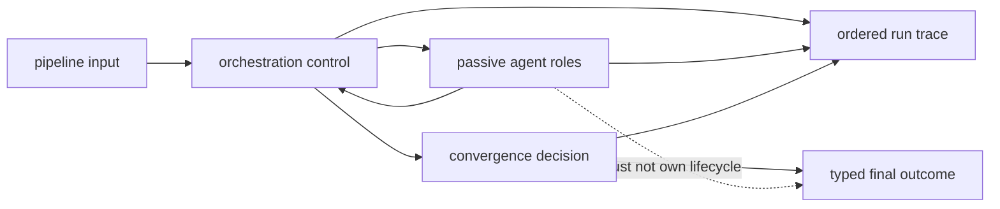

# Architecture Risks

Agent systems fail structurally when role output, orchestration policy, and run
evidence become indistinguishable. A fluent final answer can hide an invalid
lifecycle, an unrecorded model change, or a veto that was ignored.

## Authority And Evidence Flow

Control decides who acts and why execution stops. Roles contribute bounded
outputs. The trace records both; it must not allow a role's fluent response to
stand in for a lifecycle or acceptance decision.

## Risk Register

| Risk | Misleading outcome | Control |
| --- | --- | --- |
| role-policy leakage | a prompt or role decides lifecycle authority | keep transitions and limits in pipeline control |
| model identity drift | replay labels survive provider, model, or temperature changes | bind model metadata and hashes to the trace |
| false convergence | stable low-quality or oscillating output is accepted | record strategy, window, scores, reason, and limits |
| veto erasure | normally completed calls are reported as a passing run | preserve decision and termination independently |
| partial artifact pair | final result exists without a valid trace or vice versa | use a fresh directory and validate both files |
| batch evidence collapse | one primary success hides other file failures | retain per-file outcomes with the primary artifact |
| credential overreach | every CLI operation requires unrelated provider secrets | isolate secrets and keep the constraint visible |
| HTTP capability overclaim | request config implies unsupported provider control | document and enforce the fixed offline v1 posture |

## Orchestration Can Absorb Neighboring Semantics

Agent owns who acts next and why execution stops. It does not own the truth of a
reason claim or runtime-wide acceptance. Putting evidence interpretation into a
planner prompt or deployment authority into a verifier role creates policy that
cannot be reviewed independently from model output.

Use typed handoffs to reason and runtime instead of widening role prompts.

## Replayability Can Be Declared Too Easily

Zero temperature is required but not sufficient. Replay also needs input,
configuration, prompt, model, pipeline-definition, contract, and convergence
identity. Provider nondeterminism or an unpinned model can remain even at zero
temperature. The trace must report its actual replay classification rather than
infer it from one setting.

## Convergence Can Reward Repetition

A stable verdict or confidence sequence can converge even when the underlying
content is poor. Convergence describes orchestration stability, not correctness.
Verification, quality thresholds, epistemic status, and evidence review remain
separate gates. Maximum-iteration termination must not be relabeled as
convergence.

## Artifact Publication Is Not Transactional

Trace and final result use ordinary separate writes. Reusing one output root
can combine a new result with an old trace after interruption. Allocate a fresh
root for every material attempt, then load the trace, reconstruct the outcome,
and compare the public result before publication.

## Batch Output Needs Its Own Contract

The CLI can process a directory but the canonical final artifact is derived
from the first successful entry. A consumer that keeps only that file loses the
batch's remaining successes and failures. Batch automation must retain the
complete processing summary or isolate inputs into separate run directories.

## Bootstrap Credentials Expand Exposure

The CLI loads `.env` and validates four provider keys before argument parsing.
That increases secret exposure for help, dry-run, local, and replay operations.
Use approved secret injection, restrict process environments, never commit
`.env`, and do not treat key presence as provider health or authorization.

## Observability Can Leak Source and Prompts

Structured logs and traces may contain document content, prompts, role output,
failure details, and model metadata. Apply redaction, access, and retention at
the output root. Telemetry must observe lifecycle decisions without becoming
an alternate ungoverned record of sensitive work.

See [security and safety](../operations/security-and-safety.md) and
[known limitations](../quality/known-limitations.md) for current controls.
