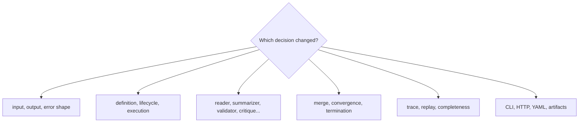

# Code Navigation

Navigate agent by the decision owner. Pipeline code decides order and stop
conditions, role packages perform bounded work, result code determines the
published outcome, and trace code preserves the evidence.

## Navigate by concern

| Concern | Begin in | Continue in | Evidence family |
| --- | --- | --- | --- |
| role input, output, error, or plan | `contracts/` | final models and API schemas | contract, final-model, key-set, schema tests |
| pipeline phases and allowed roles | `pipeline/definition.py` | control lifecycle and agent registry | architecture snapshots and lifecycle invariants |
| transition or stop condition | `pipeline/control/` | execution lifecycle and iteration transitions | controller, kernel, workflow-graph, ordering tests |
| sharding, stage order, or merge | `pipeline/execution/` | `pipeline/results/` | pipeline flow, shard merge, outcome tests |
| one role's behavior | matching package under `agents/` | shared agent base and stage context | role-specific tests and passive-agent invariants |
| convergence or oscillation | `pipeline/convergence/` | termination and result decision | strategy, snapshot, hash, monitor, outcome tests |
| terminal result or failure | `pipeline/results/` and `pipeline/termination.py` | trace final projection | failure taxonomy, finalization, completeness tests |
| trace schema or replayability | `traces/` | `pipeline/trace_validation/` and replay command support | mandatory-field, version, reconstruction, mismatch tests |
| provider behavior | `llm/` | selected role strategy and model metadata | adapter/runtime tests; live integration only when provider-specific |
| CLI configuration and files | `interfaces/cli/` | config, runtime setup, result artifacts | CLI, dry-run, examples golden, parity tests |
| HTTP v1 | `api/v1/` | strict schemas and fixed handler configuration | v1 contract, OpenAPI, CLI/HTTP parity tests |

Paths are relative to
`packages/bijux-canon-agent/src/bijux_canon_agent/` unless stated otherwise.

## Follow one terminal decision

1. Find the pipeline definition and applicable lifecycle transition.
2. Follow the controller into the selected role or execution stage.
3. Inspect role output, shard merge, final validation, and convergence snapshot.
4. Keep verdict, epistemic state, convergence, and termination distinct.
5. Follow finalization into the trace and published result projection.
6. Validate trace ordering, completeness, replay fields, and the exact parity
   subset used by the replay command.

## Architectural guardrails

| Test boundary | Ownership protected |
| --- | --- |
| `tests/invariants/test_agents_passive.py` | roles do not become orchestrators |
| `tests/invariants/test_agents_no_lifecycle_overrides.py` | lifecycle authority remains central |
| `tests/invariants/test_pipeline_layering.py` | pipeline dependencies remain directional |
| `tests/invariants/test_api_thin.py` | HTTP remains an adapter rather than a second pipeline |
| trace schema and reconstruction tests | stored evidence remains interpretable |
| `tests/api/test_cli_http_parity.py` | equivalent public concepts keep compatible meaning |

When a role defect changes terminal state or trace completeness, retain the
narrow role regression and add pipeline evidence. When CLI and HTTP can
interpret the same concept differently, add parity evidence as well.
